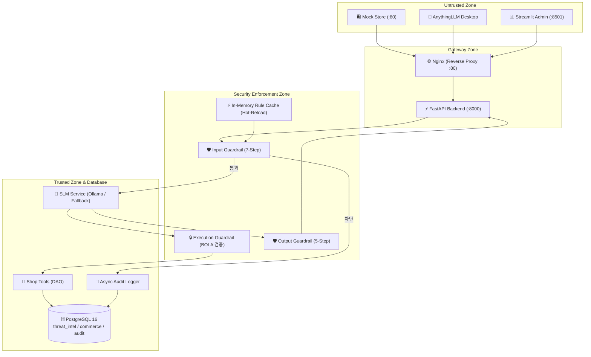

# 🛡️ AI Security Guardrail Chatbot System

[](https://github.com/ai-security-guardrail-chatbot)
[](https://www.python.org/downloads/)
[](https://fastapi.tiangolo.com)
[](https://www.docker.com/)
[](https://www.postgresql.org/)
[](https://owasp.org/www-project-top-10-for-large-language-model-applications/)

---

## 📖 프로젝트 소개 (Introduction)

**AI Security Guardrail Chatbot**은 생성형 AI(Generative AI) 및 소형 언어 모델(SLM)을 실제 E-커머스 및 비즈니스 환경에 도입할 때 발생하는 **OWASP Top 10 for LLM 위협(프롬프트 인젝션, 시스템 탈취, 권한 상승, PII 유출, 리버스 쉘 페이로드 등)**을 선제적으로 방어하는 **엔터프라이즈급 다계층 AI 보안 게이트웨이 시스템**입니다.

### 🌟 핵심 특징
1. **7단계 Input Guardrail**: 요청 검증 ➔ 길이 제한 ➔ 유니코드 NFKC 정규화 ➔ 호모글리프 탐지 ➔ Base64/URL 난독화 해제 ➔ 정규식/위협 시그니처 ➔ 시맨틱/페르소나 제어.
2. **BOLA/IDOR Execution Guardrail**: 도구 호출(Tool Calling) 시 파라미터 경계 및 고객 주문 소유권 상시 검증.
3. **5단계 Output Guardrail**: 시스템 프롬프트 유출 차단, 리버스 쉘 탐지, PII(주민번호, 카드, 전화번호, **대외비 상품 원가**) 자동 마스킹(`[REDACTED]`), XSS 살균.
4. **PostgreSQL 16 기반 위협 인텔리전스 & Hot-Reload**: `threat_intel`, `commerce`, `audit` 3대 스키마 격리 및 인메모리 룰 캐시 실시간 동기화.
5. **표준 클라이언트 호환**: 순수 HTML/JS 쇼핑몰 웹 UI(`mock_store`), AnythingLLM 연동용 OpenAI 규격(`/v1/chat/completions`), Streamlit 보안 관제 대시보드(`admin_ui`).

---

## 🏗️ 시스템 아키텍처 (Architecture)



---

## 📁 디렉터리 구조 (Project Layout)

```
ai-security-guardrail-chatbot/
├── .github/
│   └── workflows/
│       └── ci.yml                  # GitHub Actions CI 파이프라인
├── docs/
│   └── engineering/                # 12종 엔지니어링 표준 가이드라인
│       ├── PROJECT_SCOPE.md
│       ├── ARCHITECTURE.md
│       ├── CODING_STANDARDS.md
│       ├── API_CONTRACT.md
│       ├── DATABASE_DESIGN.md
│       ├── SECURITY_POLICY.md
│       ├── TEST_STRATEGY.md
│       ├── DEPLOYMENT_GUIDE.md
│       ├── GIT_WORKFLOW.md
│       ├── DEVELOPMENT_ROADMAP.md
│       ├── DEFINITION_OF_DONE.md
│       └── ADR/README.md
├── backend/
│   ├── app/
│   │   ├── api/                    # REST 및 OpenAI 호환 라우터
│   │   ├── core/                   # 설정, 로깅, 예외, 보안 유틸
│   │   ├── guardrails/             # 7-Step Input, 5-Step Output, Execution 가드레일, RuleManager
│   │   ├── models/                 # 데이터 모델
│   │   ├── schemas/                # Pydantic v2 DTO 스키마
│   │   ├── repositories/           # ThreatDAO, ShopDAO, AuditDAO
│   │   ├── services/               # SLMService, ShopService, AuditService
│   │   ├── database/               # PostgreSQL DDL 및 세션
│   │   └── main.py                 # FastAPI 애플리케이션 진입점
│   ├── tests/                      # pytest 단위 및 통합 테스트 스위트
│   ├── Dockerfile                  # 백엔드 컨테이너 빌드 파일
│   └── requirements.txt            # 백엔드 의존성 파일
├── mock_store/                     # 가상 쇼핑몰 웹 UI & 챗봇 위젯 (HTML/CSS/JS)
├── admin_ui/                       # Streamlit 보안 관제 및 동적 룰셋 관리 UI
├── nginx/                          # Nginx 리버스 프록시 및 정적 서빙 설정
├── database/migrations/            # PostgreSQL DDL 마이그레이션 스크립트
├── .env.example                    # 안전한 환경변수 템플릿 (하드코딩 배제)
├── .gitignore                      # Git 추적 제외 규칙
├── pyproject.toml                  # Ruff, pytest, 메타데이터 설정
└── docker-compose.yml              # PostgreSQL, Backend, AdminUI, Nginx 오케스트레이션
```

---

## 🚀 빠른 시작 (Quick Start)

### 1. 환경변수 준비
```bash
cp .env.example .env
```

### 2. Docker Compose 원클릭 실행
```bash
docker compose up --build -d
```

### 3. 접속 주소 안내
- **🛍️ 쇼핑몰 웹 UI (Mock Store)**: `http://localhost`
- **📊 보안 관제 대시보드 (Streamlit Admin)**: `http://localhost:8501`
- **🔌 FastAPI Swagger API 명세**: `http://localhost:8000/docs`
- **💬 AnythingLLM 연동 Base URL**: `http://localhost:8000/v1`

---

## 🧪 로컬 테스트 및 검증 (Testing)

```bash
# 가상환경 의존성 설치
pip install -r backend/requirements.txt
pip install ruff pytest pytest-asyncio pytest-cov

# Ruff 린트 및 코드 스타일 검사
ruff check backend/

# 전체 테스트 실행 및 커버리지 측정
pytest -v --cov=backend/app backend/tests/

# Docker Compose 설정 유효성 검사
docker compose config --quiet
```
