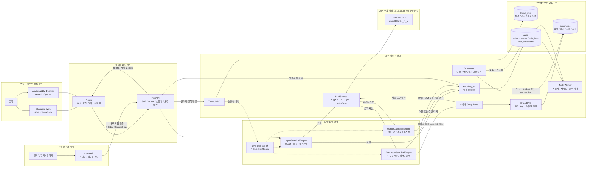
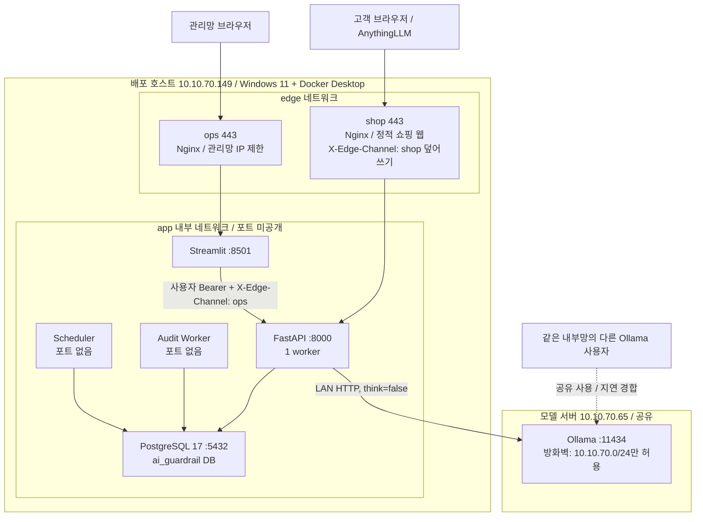

# 시스템 구성도

| 항목 | 값 |
|---|---|
| 문서 번호 / 버전 / 작성일 | DES-001 / 1.1 / 2026-10-02 (D-14~D-23 반영) |
| 상태 | 구현 전 제안 설계 |
| 연계 | [목차·설계 결정](README.md), [DB](02_database_design.md), [E2E 흐름](03_user_flow.md), [API](05_api_integration_spec.md) |

## 1. 논리 시스템 구성

참조 구성도의 Input → SLM/RAG → Execution → Output 경계를 유지한다. 도구가 없는 질의는 Execution을 건너뛰고, 도구 결과가 있는 질의는 모델에 결과를 전달해 최종 답변을 생성한다. 차단·정상·마스킹·변경 확인·오류 모두 감사 경로에 연결된다.

AnythingLLM은 Ollama가 아니라 반드시 shop Nginx의 `/v1`(우리 게이트웨이)에 연결한다. Ollama에 직접 연결하면 가드레일 전체를 우회하므로 지원 구성이 아니다. AnythingLLM의 자체 검색 결과·시스템 메시지는 서버의 신뢰된 정책으로 취급하지 않는다. 모델에 직접 DB 접속, 임의 SQL, 셸, HTTP fetch 권한을 부여하지 않는다. RAG 검색 서버는 확장점이며 초기 배포에는 존재하지 않는다.

## 2. 배포 구성과 통신

| 연결 | 프로토콜·정책 | 전송 데이터 |
|---|---|---|
| 고객 → Nginx | HTTPS 443, TLS 1.2 이상 | 로그인·질의·쇼핑·승인 요청 |
| Nginx → FastAPI | 내부 HTTP 8000, 외부 접근 차단 | 검증 전 요청, 서버 생성 request_id |
| 관리망 → Streamlit | HTTPS 역프록시(ops Nginx), WebSocket 허용, 관리망 IP 제한 | 관제 UI, operator/admin 인증 |
| Streamlit → FastAPI | app 내부망 직접 HTTP 8000, 사용자별 JWT, `X-Edge-Channel: ops` | 관제 조회·검증·정책 게시·PDF 바이트 수신 후 Streamlit이 다운로드 제공, 서비스 관리자 토큰 공유 금지 |
| FastAPI → Ollama | LAN HTTP 10.10.70.65:11434, 클라우드·외부 fetch 금지, Ollama는 인증이 없으므로 방화벽 allowlist로 제한 | 최소 컨텍스트·허용 도구·메시지, `think:false` |
| 서비스 → PostgreSQL | 내부 TCP 5432, 원격 호스트 분리 시 TLS verify-full | 매개변수 SQL, 마스킹된 감사 데이터 |
| Audit Worker → PostgreSQL | audit_worker 역할만 사용 | outbox 청구·이벤트 적재·재시도 |
| Scheduler → PostgreSQL | maintenance_worker·retention_worker 역할 | 승인·쿠폰 만료와 만료 outbox, 보존 기간 삭제 |

예시 도메인은 배포용 DNS 이름으로 교체한다. 1단계(개발·내부망)는 사설 CA 인증서와 클라이언트 hosts 등록으로 shop·ops 이름을 10.10.70.149에 연결한다. 2단계(외부 공개)는 공인 도메인·인증서를 적용하고 shop Nginx 443만 인터넷에 공개한다. ops는 관리망 IP 또는 VPN으로만 접근한다. FastAPI·Streamlit·DB 포트는 Docker에서 host로 publish하지 않는다.

Ollama는 다른 사용자도 쓰는 공유 서버(10.10.70.65)이므로 .149 단독 허용이 불가능하다. Windows 방화벽으로 11434를 10.10.70.0/24에만 허용하고 인터넷 공개를 금지한다. 같은 내부망 사용자가 모델을 직접 호출할 수 있다는 잔여 위험은 남지만 모델에는 DB·Tool 실행 권한이 없으므로 고객 데이터 접근 경로는 생기지 않는다. 다른 사용자의 동시 사용·다른 모델 적재는 지연과 모델 재적재(약 5초)를 유발하므로 지연 메트릭과 readiness의 모델 확인으로 관측한다. 2단계 외부 공개 전에 Ollama 앞에 인증 프록시를 두거나 전용 장비로 분리하는 방안을 재검토한다.

구현된 Nginx(`deployment/nginx/templates`)는 SNI 이름으로 shop·ops를 나눈다. shop은 정적 웹과 `/api`·`/v1`만 프록시하고, `/api/v1/(audit|rulesets|alerts|lab|health/ready)`는 404를 반환한다. ops는 `OPS_ALLOW_CIDR`(기본 10.10.70.0/24)과 127.0.0.1만 허용하고 Streamlit만 프록시한다. 알 수 없는 호스트 이름은 444로 끊는다. `X-Edge-Channel`·`X-Real-IP`는 항상 덮어쓰고 클라이언트의 `X-Request-Id`는 제거한다. 접근 로그는 query string 없는 경로만 남긴다. 사설 CA·서버 인증서는 `scripts/gen_certs.py`로 만든다.

FastAPI는 `X-Edge-Channel`로 진입 채널을 구분한다. shop Nginx는 클라이언트가 보낸 값과 무관하게 `shop`으로 덮어쓰고, Streamlit만 `ops`를 설정한다. FastAPI 포트는 app 내부망에만 있으므로 외부에서 `ops`를 위조할 경로가 없다. operator/admin 토큰은 ops 채널에서만, customer JWT·client token은 shop 채널에서만 허용한다. 관제·룰 API는 ops 채널이 아니면 404로 처리한다.

초기 FastAPI는 1 process/worker로 두어 사용자별 메모리 rate limiter와 룰 캐시를 단순화한다. 2개 이상 프로세스로 확장하려면 공유 요청 예산 저장소와 모든 worker의 룰셋 준비 상태 확인을 먼저 추가한다. Nginx는 IP당 10 req/s·burst 20, FastAPI 챗봇은 사용자별 30 req/min·동시 추론 1건, 서버 전체 추론 동시 1건을 초기 제한으로 사용한다. 2026-10-02 실측에서 qwen3:8b는 생성 약 7.2 tokens/s, prompt 처리 약 80 tokens/s였다. 동시 2건은 각 요청 속도를 절반으로 낮추므로 대기열(최대 대기 30초 초과 시 429)로 처리한다. 추론 예산은 num_predict 512, num_ctx 8192, 호출당 120초, 요청 전체 240초, keep_alive 30분이다. 사용자 수·모델 서버 용량을 측정한 뒤 변경한다.

## 3. 구성요소 책임과 제안 모듈

| 구성요소 / 제안 경로 | 책임 | 직접 하지 않는 작업 |
|---|---|---|
| Nginx / deployment/nginx.conf | TLS, 크기 제한, trusted proxy, SSE buffering 해제, CSP | 사용자·도구 권한의 최종 판정 |
| backend/main.py | 라우팅, 인증, 입력 타입, 예산, 응답 어댑터, 감사 영속화 확인 | raw 토큰 즉시 반환 |
| backend/guardrails/input_guardrail.py | inspect(messages, snapshot), 원문 및 검사 변형 검사 | 사용자 의도만으로 DB 권한 부여 |
| backend/services/slm_service.py | generate_response(), 도구 호출 결과 재추론, 호출 deadline | 임의 도구·SQL·셸 실행 |
| backend/guardrails/execution_guardrail.py | authorize_tool(), 소유권·허용 인자·확인 요구 | 모델이 준 user_id를 신뢰 |
| backend/services/shop_service.py | prepare_action(), confirm_action(), 고정 도구 실행 | 주문 생성·결제 |
| backend/guardrails/output_guardrail.py | sanitize(), 전체 검사·치환·마스킹 | 클라이언트별 정책 해제 |
| backend/database/audit_logger.py | persist_event(), 같은 트랜잭션에 outbox INSERT | 원문·비밀값 로깅 |
| backend/workers/audit_worker.py | drain_outbox(), 이벤트 UUID 기준 멱등 적재 | commerce 데이터 조회·변경 |
| backend/workers/scheduler.py | expire_actions(), expire_coupons(), purge_retention() | 고객 요청 처리·모델 호출 |
| backend/services/rule_cache.py | request 동안 고정 snapshot, publish reload | 검사 중 룰셋 부분 교체 |
| frontend/shop/ | 고객 로그인·쇼핑·AI 채팅·승인 | 비밀 키·서버 정책 보관 |
| frontend/app.py | 관제·감사·정책·PDF·관리자 검증 챗, lab에서만 A/B 비교 화면 | DB 직접 접속·운영 OFF |

모듈 경로는 설계상 책임 분리를 표현한 제안이다. 아직 파일이나 해당 함수는 구현되어 있지 않다.

## 4. 신뢰 경계와 데이터 최소화

| 경계 | 위험 | 집행 |
|---|---|---|
| 고객·클라이언트 → API | JWT 위조, user_id·guardrail 변조, 과대 요청 | 서버 인증·길이·요청 수 검증, role·scope는 서버 저장값과 대조 |
| 외부 입력·RAG → 모델 | 직접·간접 인젝션, 가짜 system/tool 메시지 | 서버 system prompt 우선, 클라이언트 컨텍스트 비신뢰 표시·검사 |
| 모델 → Tool | 과도한 권한, BOLA/IDOR, 임의 함수·SQL | allowlist, 엄격한 JSON 인자, 소유권, 승인 API |
| Tool → commerce | 다른 사용자 자료, 잔여 승인 재사용 | user_id 인증 문맥에서 주입, 명시적 WHERE·트랜잭션·버전 |
| 모델 → UI | PII·기밀·XSS·이미지 유출 | 전체 검사 후 전송, HTML 비활성, 외부 이미지 차단 |
| API → 감사·관제 | 로그에 비밀 저장, 관제 권한 남용 | 엄격한 payload 스키마, 요약 마스킹, RBAC, 별도 관리망 |

JWT·refresh·client token·비밀번호·실제 기밀은 모델 입력과 감사 payload에 포함하지 않는다. 상품·주문 Tool은 답변에 필요한 필드만 반환한다. 배송지·전화·이메일을 기본 Tool 응답에서 제외하고, 고객 UI가 필요한 개인정보는 별도 소유권 검증 API로 취급한다.

검사용 원문은 요청 메모리에서만 유지한다. 장기 저장은 마스킹된 대화·감사 요약으로 제한한다. 컨텍스트 마스킹으로 과거 지시대명사 해석이 불완전해질 수 있으므로 단일 턴 룰과 소유권 검증을 함께 적용한다.

## 5. 정상·차단·보조 흐름과 장애 정책

정상 흐름은 인증 → 입력 검사 → 필요 시 Tool 검증·조회 → 모델 최종 응답 → 출력 검사 → outbox 영속화 → JSON/SSE다. 입력 차단은 Ollama 호출 없이 안전한 거절문과 감사 이벤트만 생성한다. 실행 차단은 도구를 실행하지 않고, 출력 차단은 raw 응답 전체를 폐기한다. 변경 요청은 pending action을 만들고 사용자 확인을 기다린다.

보조 흐름은 관리자 룰 검증·게시 → 불변 룰셋 캐시 교체, outbox → 감사 worker 적재, 관제 조회·PDF 생성이다. 요청 시작 시 선택한 ruleset_version을 완료까지 유지한다. 출력이 차단되면 해당 요청에서 생성한 아직 pending인 변경 제안도 cancelled로 전환한다.

| 상황 | 응답·동작 | 관측 |
|---|---|---|
| 최초 룰셋 로드 실패 | readiness 실패, 챗봇 503 | ruleset_loaded=0 |
| 새 룰셋 검증·reload 실패 | 기존 정상 버전 유지, 관리자 실패 표시 | reload_error_total, active version |
| Ollama 연결 실패 / timeout | 502 / 504, 고정 장애 안내, outbox 기록 | inference_errors, inference_duration |
| 공유 Ollama 경합·모델 재적재 | 대기열 초과 429, 처리 중이면 deadline까지 대기 | inference_queue_wait, model_load_duration |
| 추론 대기열 포화 | 429 RATE_LIMITED, Retry-After | inference_queue_depth |
| outbox 기록 불가 / DB 장애 | 503, 모델·도구 결과를 반환하지 않음 | 감사 저장소와 독립적인 서버 메트릭·고정 오류 로그 |
| worker 중단 | outbox가 영속화되면 응답 가능, backlog 한도 초과 시 503 | oldest_pending_age, pending_count |
| 변경 트랜잭션 실패 | 변경·승인 상태·감사 outbox 모두 rollback | action_failures, DB error class |
| SSE 중 연결 종료 | 모델 raw 미노출, 이미 확정된 audit 결과에 전송 완료를 의미하지 않음 | delivery_disconnect_total |

운영 Fallback NLG는 고정된 장애 안내 문구로 한정한다. 상품·주문 조회 성공이나 변경 완료를 임의 생성하지 않는다. readiness는 DB 연결·게시 룰셋·모델 존재와 digest 일치·outbox backlog·APP_ENV와 GUARDRAIL_ENFORCED 조합을 확인한다. liveness는 프로세스 생존만 검사한다.

## 6. 확장 지점

서버 RAG를 추가할 때는 문서 수집·출처·접근 제어·검사·문서 버전·사용자별 검색 범위를 별도로 설계한다. 초기 DB에는 vector extension·embedding 테이블을 설치하지 않는다. 소형 분류 모델을 추가할 때는 별도 timeout·오탐·비용과 판정 통합 규칙을 시험한 뒤 게시한다. 현재의 의미론적 탐지는 문맥 규칙 조합이며 학습 모델 기반 의미 이해로 표현하지 않는다.

## 7. lab 비교 환경 (ON/OFF 검증)

가드레일이 실제로 효과가 있는지 "OFF면 공격 성공, ON이면 차단·마스킹"으로 보이기 위해 운영과 분리된 `lab` 환경을 둔다. 같은 이미지·코드·룰셋·모델을 쓰며 compose project 이름·DB volume·네트워크·포트·JWT 키를 운영과 공유하지 않는다.

| 항목 | production | lab |
|---|---|---|
| APP_ENV | production | lab |
| 가드레일 | 항상 ON, OFF 설정 시 readiness 실패 | 관리자(lab admin)가 비교 실행 단위로 ON/OFF 지정 |
| 데이터 | 실제 업무 데이터 | 합성 고객·주문·PII, `.invalid` 도메인 |
| 비밀 | 시스템 프롬프트에 비밀 없음 | 시스템 프롬프트·Tool 결과에 합성 미끼 비밀(PLN-003) 주입 |
| 화면 | ON badge만 표시 | Streamlit lab 페이지에 ON/OFF 비교·A/B 리포트 |
| 접근 | shop·ops | ops 관리망 전용, 고객 접근 없음 |

OFF는 입력·실행·출력 **가드레일 엔진**만 건너뛴다. 인증·DAO의 user_id 조건·변경 승인은 OFF에서도 유지된다. 이 계층들은 가드레일이 아니라 기본 권한 통제이기 때문이다. 따라서 A/B 리포트는 각 공격이 어느 계층에서 막혔는지(가드레일 / 권한 통제 / 미방어)를 구분해 표시한다. A/B 러너는 고정 공격·정상 시험셋을 같은 모델 설정으로 ON·OFF 각각 실행한다. 사례별로 응답 status, 미끼 비밀·합성 PII의 노출 여부, 적중 rule_id를 비교한다(T-26).

**구현(2026-10-06):** lab은 `.env.lab`(COMPOSE_PROJECT_NAME=ag_lab, APP_ENV=lab, HTTPS_PORT=8443, 별도 JWT 키·DB 비밀번호)과 같은 compose 파일로 띄운다. `scripts/lab_up.sh`가 비밀 생성 → DB → migration → 관리자 → 룰셋 게시 → 나머지 서비스 순서로 실행한다. A/B 러너는 Tool을 쓰지 않는 질의로 OFF(가드레일·판별 없음)와 ON(규칙+판별)을 같은 lab system prompt로 실제 모델에 보낸다. 사용자에게 보일 텍스트에서 미끼 비밀·합성 연락처(구분자 제거·Base64 복호 포함)·실행 가능한 markup 노출을 결정적으로 판정한다. OFF 원문은 화면에 표시하지 않고 판정 결과만 보여 준다. 결과는 lab API 프로세스 메모리에만 보관하며 CSV로 내려받는다.

lab의 OFF 경로는 `APP_ENV=lab`일 때만 코드에 등록한다. production 이미지에서 같은 설정을 넣으면 시작 단계에서 거부한다. lab 결과를 운영 탐지율로 보고하지 않으며, 측정 시점의 모델 digest·룰셋 버전·시험셋 hash를 함께 기록한다.
