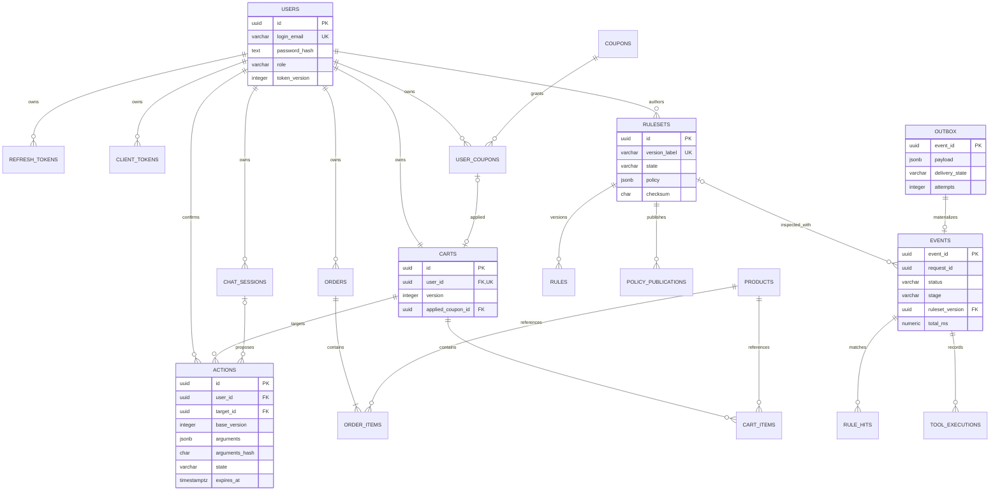

# DB 설계서

| 항목 | 값 |
|---|---|
| 문서 번호 / 버전 / 작성일 | DES-002 / 1.1 / 2026-10-02 (D-18 반영) |
| 상태 | 구현 전 제안 스키마·DDL |
| 연계 | [공통 기준](README.md), [API 데이터 계약](05_api_integration_spec.md), [보안·감사](06_guardrail_security_design.md) |

## 1. 저장소 원칙

PostgreSQL 17, DB 이름 `ai_guardrail`, UTF-8을 기준으로 한다. `commerce`, `threat_intel`, `audit` 스키마를 단일 DB에 둔다. UUID는 `gen_random_uuid()`, 시간은 `timestamptz`, 금액은 KRW 정수, 구조화된 안전한 메타데이터는 `jsonb`를 사용한다. SQLite·vector extension은 초기 구성에 포함하지 않는다.

계정 이메일은 소문자로 정규화하고 비밀번호는 Argon2id 해시만 저장한다. refresh/client token은 CSPRNG 256-bit 이상으로 생성해 SHA-256 해시만 저장한다. 토큰 평문·JWT·원문 개인정보·모델 raw 응답은 감사 테이블에 저장하지 않는다. 실제 기밀을 시험용 데이터로 사용하지 않는다.

마스킹된 대화 컨텍스트도 개인정보가 남을 가능성이 있는 데이터로 분류한다. 상품명·수량·주문 상태 등 허용된 구조화 정보와 정제된 답변만 보관하고, 입력의 비밀값·연락처·주소는 제거한다. 모델 재학습에는 사용하지 않는다.

## 2. ERD



ERD의 OUTBOX→EVENTS는 `event_id`로 연결한 논리적 관계이며 FK가 아니다. delivered outbox를 24시간 후 삭제해도 감사 이벤트를 90일 유지하기 위함이다. audit의 session_id/action_id도 30일 세션·승인 기록 삭제를 허용하는 논리적 참조다.

## 3. 테이블·컬럼 정의

아래 초기 DDL이 컬럼·타입·NULL·기본값·PK/FK·CHECK·인덱스의 기준이다. UUID `id`는 별도 표기가 없으면 자동 생성 PK, `created_at`은 서버 시각이다.

| 테이블 | 핵심 데이터 | 제약·의미 |
|---|---|---|
| commerce.users | login_email, password_hash, role, token_version, is_active | 이메일 UNIQUE·소문자, customer/operator/admin, 비활성 계정 토큰 불허 |
| commerce.refresh_tokens | user_id, token_hash, family_id, expires_at, revoked_at | token_hash UNIQUE, 회전·재사용 감지 family 전체 폐기 |
| commerce.client_tokens | user_id, name, token_hash, scopes, token_version, expires_at, revoked_at | 평문 1회 노출, 허용 scope 배열, 사용자 token_version 대조 |
| commerce.chat_sessions | user_id, source, context_redacted, risk_signals, last_activity_at | id/user_id 복합 UNIQUE, context는 정제된 최대 40개 메시지 |
| commerce.products | sku, name, description, price_krw, stock_count, is_active | SKU UNIQUE, 음수 가격·재고 불가, 고객 수정 불가 |
| commerce.orders | user_id, external_ref, status, total_krw, placed_at | 외부 이력 조회 전용, external_ref UNIQUE, 사용자 소유권 |
| commerce.order_items | order_id, product_id, product_name, unit_price_krw, quantity | 주문 당시 명칭·가격 스냅샷, 주문당 상품 UNIQUE |
| commerce.coupons | code, discount_krw, min_subtotal_krw, expires_at, is_active | 정액 할인, 총 상품금액보다 할인액이 크면 최종금액 0 |
| commerce.user_coupons | user_id, coupon_id, state | 사용자당 동일 쿠폰 1개, available/used/expired |
| commerce.carts | user_id, version, applied_coupon_id | 사용자당 1개, 쿠폰 복합 FK로 동일 사용자 소유 강제 |
| commerce.cart_items | cart_id, product_id, quantity | 복합 PK, 수량 1~99, 상품 존재·재고는 실행 시 재확인 |
| commerce.actions | request_id, user_id, session_id, tool_name, target_id, arguments, arguments_hash, base_version, ruleset_version, state, expires_at, idempotency_key, result | 본인 cart, 인자·hash 불변, pending result는 가격·preview 스냅샷, executed result는 확정 결과 |
| threat_intel.rulesets | version_label, state, parent_id, policy, checksum, created_by, validated_at, activated_at | draft/validated/active/retired, active 최대 1개 |
| threat_intel.rules | ruleset_id, rule_id, stage, category, kind, pattern, flags, action, marker, priority | 버전별 rule_id PK, draft에서만 변경 가능 |
| threat_intel.policy_publications | ruleset_id, previous_id, actor_id, request_id, outcome, detail | 게시·실패·롤백 이력, 기밀 없는 고정 사유 |
| audit.outbox | event_id, payload, delivery_state, attempts, available_at, created_at, delivered_at, last_error_code | pending/delivered/dead, 원문 없는 검증된 envelope |
| audit.events | request_id, actor_id, session_id, source, api_path, model, status, stage, ruleset_version, input_chars, output_chars, input_ms, output_ms, total_ms, summary_redacted, occurred_at | event_id PK, append-only, stage·status 일관성 |
| audit.rule_hits | event_id, rule_id, category, stage, action, match_count | 같은 event/rule 1행, 매칭 원문 저장 금지 |
| audit.tool_executions | id, event_id, action_id, tool_name, outcome, target_id, duration_ms | read/proposed/executed/denied/error, 인자 평문 덤프 금지 |
| audit.alerts | kind, severity, fingerprint, detail, occurrences, first/last_seen_at, state, acknowledged_by/at | D-26 관제 경보. judge_unavailable / suspicious_input_repeat / outbox_dead(migration 0004), kind·지문당 open 1행(partial unique), 원문 없음. migration 0003 |

`total_ms`는 요청 수신부터 outbox commit 완료 직전까지의 서버 처리 시간이며 SSE 전송 시간은 제외한다. `input_ms`는 입력 검사, `output_ms`는 출력 검사 누계다. 실행 검증 지연과 추론 지연은 서비스 메트릭에서 별도 측정한다. 존재하지 않는 단계는 0으로 기록하고 model·ruleset_version은 처리 이전 실패 시 NULL일 수 있다.

## 4. 초기 SQL DDL

빈 DB에 migration owner로 한 번 적용할 초기 스키마 제안이다. 실제 서버에 적용한 migration이 아니다. 아래 SQL은 표준 기능만 사용하며 확장 설치가 필요하지 않다. 운영 migration runner가 전후 트랜잭션·버전 기록을 관리한다.

```sql
BEGIN;
CREATE SCHEMA commerce;
CREATE SCHEMA threat_intel;
CREATE SCHEMA audit;

CREATE TABLE commerce.users (
  id uuid PRIMARY KEY DEFAULT gen_random_uuid(),
  login_email varchar(254) NOT NULL UNIQUE,
  password_hash text NOT NULL,
  role varchar(16) NOT NULL DEFAULT 'customer'
    CHECK (role IN ('customer','operator','admin')),
  token_version integer NOT NULL DEFAULT 0 CHECK (token_version >= 0),
  is_active boolean NOT NULL DEFAULT true,
  created_at timestamptz NOT NULL DEFAULT now(),
  CHECK (login_email = lower(login_email))
);
CREATE TABLE commerce.refresh_tokens (
  id uuid PRIMARY KEY DEFAULT gen_random_uuid(),
  user_id uuid NOT NULL REFERENCES commerce.users(id),
  token_hash char(64) NOT NULL UNIQUE CHECK (token_hash ~ '^[0-9a-f]{64}$'),
  family_id uuid NOT NULL,
  expires_at timestamptz NOT NULL,
  revoked_at timestamptz,
  created_at timestamptz NOT NULL DEFAULT now(),
  CHECK (expires_at > created_at)
);
CREATE INDEX refresh_tokens_family_idx ON commerce.refresh_tokens(user_id, family_id);
CREATE TABLE commerce.client_tokens (
  id uuid PRIMARY KEY DEFAULT gen_random_uuid(),
  user_id uuid NOT NULL REFERENCES commerce.users(id),
  name varchar(80) NOT NULL,
  token_hash char(64) NOT NULL UNIQUE CHECK (token_hash ~ '^[0-9a-f]{64}$'),
  scopes text[] NOT NULL CHECK (cardinality(scopes) > 0 AND
    scopes <@ ARRAY['chat:write','models:read','tools:read','shop:read','actions:propose']::text[]),
  token_version integer NOT NULL CHECK (token_version >= 0),
  expires_at timestamptz NOT NULL,
  revoked_at timestamptz,
  created_at timestamptz NOT NULL DEFAULT now(),
  CHECK (expires_at > created_at)
);
CREATE INDEX client_tokens_user_idx ON commerce.client_tokens(user_id, created_at DESC);
CREATE TABLE commerce.chat_sessions (
  id uuid PRIMARY KEY DEFAULT gen_random_uuid(),
  user_id uuid NOT NULL REFERENCES commerce.users(id),
  source varchar(16) NOT NULL CHECK (source IN ('web','anythingllm','streamlit')),
  context_redacted jsonb NOT NULL DEFAULT '[]'::jsonb CHECK (jsonb_typeof(context_redacted)='array'),
  risk_signals jsonb NOT NULL DEFAULT '{}'::jsonb CHECK (jsonb_typeof(risk_signals)='object'),
  created_at timestamptz NOT NULL DEFAULT now(),
  last_activity_at timestamptz NOT NULL DEFAULT now(),
  UNIQUE (id, user_id)
);
CREATE INDEX chat_sessions_owner_idx ON commerce.chat_sessions(user_id, last_activity_at DESC);
CREATE TABLE commerce.products (
  id uuid PRIMARY KEY DEFAULT gen_random_uuid(),
  sku varchar(64) NOT NULL UNIQUE,
  name varchar(200) NOT NULL,
  description varchar(2000) NOT NULL DEFAULT '',
  price_krw bigint NOT NULL CHECK (price_krw >= 0),
  stock_count integer NOT NULL DEFAULT 0 CHECK (stock_count >= 0),
  is_active boolean NOT NULL DEFAULT true,
  created_at timestamptz NOT NULL DEFAULT now()
);
CREATE INDEX products_active_idx ON commerce.products(is_active, name);
CREATE TABLE commerce.orders (
  id uuid PRIMARY KEY DEFAULT gen_random_uuid(),
  user_id uuid NOT NULL REFERENCES commerce.users(id),
  external_ref varchar(128) NOT NULL UNIQUE,
  status varchar(16) NOT NULL CHECK (status IN ('confirmed','shipped','delivered','cancelled')),
  total_krw bigint NOT NULL CHECK (total_krw >= 0),
  placed_at timestamptz NOT NULL,
  created_at timestamptz NOT NULL DEFAULT now()
);
CREATE INDEX orders_owner_idx ON commerce.orders(user_id, placed_at DESC, id);
CREATE TABLE commerce.order_items (
  id uuid PRIMARY KEY DEFAULT gen_random_uuid(),
  order_id uuid NOT NULL REFERENCES commerce.orders(id),
  product_id uuid NOT NULL REFERENCES commerce.products(id),
  product_name varchar(200) NOT NULL,
  unit_price_krw bigint NOT NULL CHECK (unit_price_krw >= 0),
  quantity integer NOT NULL CHECK (quantity BETWEEN 1 AND 99),
  UNIQUE (order_id, product_id)
);
CREATE TABLE commerce.coupons (
  id uuid PRIMARY KEY DEFAULT gen_random_uuid(),
  code varchar(40) NOT NULL UNIQUE,
  discount_krw bigint NOT NULL CHECK (discount_krw > 0),
  min_subtotal_krw bigint NOT NULL DEFAULT 0 CHECK (min_subtotal_krw >= 0),
  expires_at timestamptz NOT NULL,
  is_active boolean NOT NULL DEFAULT true
);
CREATE TABLE commerce.user_coupons (
  id uuid PRIMARY KEY DEFAULT gen_random_uuid(),
  user_id uuid NOT NULL REFERENCES commerce.users(id),
  coupon_id uuid NOT NULL REFERENCES commerce.coupons(id),
  state varchar(16) NOT NULL DEFAULT 'available' CHECK (state IN ('available','used','expired')),
  created_at timestamptz NOT NULL DEFAULT now(),
  UNIQUE (user_id, coupon_id),
  UNIQUE (id, user_id)
);
CREATE TABLE commerce.carts (
  id uuid PRIMARY KEY DEFAULT gen_random_uuid(),
  user_id uuid NOT NULL UNIQUE REFERENCES commerce.users(id),
  version integer NOT NULL DEFAULT 0 CHECK (version >= 0),
  applied_coupon_id uuid,
  updated_at timestamptz NOT NULL DEFAULT now(),
  UNIQUE (id, user_id),
  FOREIGN KEY (applied_coupon_id, user_id) REFERENCES commerce.user_coupons(id, user_id)
);
CREATE TABLE commerce.cart_items (
  cart_id uuid NOT NULL REFERENCES commerce.carts(id) ON DELETE CASCADE,
  product_id uuid NOT NULL REFERENCES commerce.products(id),
  quantity integer NOT NULL CHECK (quantity BETWEEN 1 AND 99),
  PRIMARY KEY (cart_id, product_id)
);
CREATE TABLE threat_intel.rulesets (
  id uuid PRIMARY KEY DEFAULT gen_random_uuid(),
  version_label varchar(64) NOT NULL UNIQUE,
  state varchar(16) NOT NULL DEFAULT 'draft' CHECK (state IN ('draft','validated','active','retired')),
  parent_id uuid REFERENCES threat_intel.rulesets(id),
  policy jsonb NOT NULL DEFAULT '{}'::jsonb CHECK (jsonb_typeof(policy)='object'),
  checksum char(64) CHECK (checksum ~ '^[0-9a-f]{64}$'),
  created_by uuid NOT NULL REFERENCES commerce.users(id),
  created_at timestamptz NOT NULL DEFAULT now(),
  validated_at timestamptz,
  activated_at timestamptz,
  CHECK (state='draft' OR (checksum IS NOT NULL AND validated_at IS NOT NULL))
);
CREATE UNIQUE INDEX rulesets_one_active_idx ON threat_intel.rulesets(state) WHERE state='active';
CREATE TABLE threat_intel.rules (
  ruleset_id uuid NOT NULL REFERENCES threat_intel.rulesets(id),
  rule_id varchar(80) NOT NULL CHECK (rule_id ~ '^RULE_[A-Z0-9_]+$'),
  stage varchar(16) NOT NULL CHECK (stage IN ('input','execution','output','policy')),
  category varchar(16) NOT NULL CHECK (category ~ '^LLM(0[1-9]|10):2025$'),
  kind varchar(16) NOT NULL CHECK (kind IN ('regex','context','structural')),
  pattern text,
  flags varchar(2) NOT NULL DEFAULT '' CHECK (flags IN ('','i','is')),
  action varchar(16) NOT NULL CHECK (action IN ('block','mask','escape','observe')),
  marker varchar(40),
  priority integer NOT NULL DEFAULT 100 CHECK (priority >= 0),
  PRIMARY KEY (ruleset_id, rule_id),
  CHECK (kind <> 'regex' OR (pattern IS NOT NULL AND length(pattern) BETWEEN 1 AND 4096)),
  CHECK (action <> 'mask' OR (stage='output' AND marker IS NOT NULL))
);
CREATE FUNCTION threat_intel.require_draft_ruleset() RETURNS trigger
LANGUAGE plpgsql AS $$
DECLARE rs uuid; rs_state varchar(16);
BEGIN
  IF TG_OP='DELETE' THEN rs := OLD.ruleset_id; ELSE rs := NEW.ruleset_id; END IF;
  IF TG_OP='UPDATE' AND NEW.ruleset_id <> OLD.ruleset_id THEN
    RAISE EXCEPTION 'rule cannot move to another ruleset';
  END IF;
  SELECT state INTO rs_state FROM threat_intel.rulesets WHERE id=rs FOR UPDATE;
  IF rs_state IS DISTINCT FROM 'draft' THEN RAISE EXCEPTION 'ruleset is immutable'; END IF;
  IF TG_OP='DELETE' THEN RETURN OLD; ELSE RETURN NEW; END IF;
END $$;
CREATE TRIGGER rules_draft_only BEFORE INSERT OR UPDATE OR DELETE ON threat_intel.rules
FOR EACH ROW EXECUTE FUNCTION threat_intel.require_draft_ruleset();
CREATE FUNCTION threat_intel.freeze_validated_ruleset() RETURNS trigger
LANGUAGE plpgsql AS $$
BEGIN
  IF OLD.state <> 'draft' AND
    (NEW.policy IS DISTINCT FROM OLD.policy OR NEW.checksum IS DISTINCT FROM OLD.checksum OR
     NEW.version_label IS DISTINCT FROM OLD.version_label OR NEW.parent_id IS DISTINCT FROM OLD.parent_id OR
     NEW.created_by IS DISTINCT FROM OLD.created_by OR NEW.validated_at IS DISTINCT FROM OLD.validated_at) THEN
    RAISE EXCEPTION 'validated content is immutable';
  END IF;
  IF OLD.state <> 'draft' AND NEW.state='draft' THEN RAISE EXCEPTION 'clone a new draft'; END IF;
  RETURN NEW;
END $$;
CREATE TRIGGER rulesets_content_immutable BEFORE UPDATE ON threat_intel.rulesets
FOR EACH ROW EXECUTE FUNCTION threat_intel.freeze_validated_ruleset();
CREATE TABLE threat_intel.policy_publications (
  id uuid PRIMARY KEY DEFAULT gen_random_uuid(),
  ruleset_id uuid NOT NULL REFERENCES threat_intel.rulesets(id),
  previous_id uuid REFERENCES threat_intel.rulesets(id),
  actor_id uuid NOT NULL REFERENCES commerce.users(id),
  request_id uuid NOT NULL,
  outcome varchar(16) NOT NULL CHECK (outcome IN ('published','failed','rolled_back')),
  detail varchar(300) NOT NULL,
  created_at timestamptz NOT NULL DEFAULT now()
);
CREATE TABLE commerce.actions (
  id uuid PRIMARY KEY DEFAULT gen_random_uuid(),
  request_id uuid NOT NULL UNIQUE,
  user_id uuid NOT NULL REFERENCES commerce.users(id),
  session_id uuid,
  tool_name varchar(64) NOT NULL CHECK (tool_name IN ('set_cart_item','remove_cart_item','apply_coupon','remove_coupon')),
  target_id uuid NOT NULL,
  arguments jsonb NOT NULL CHECK (jsonb_typeof(arguments)='object' AND NOT (arguments ? 'user_id')),
  arguments_hash char(64) NOT NULL CHECK (arguments_hash ~ '^[0-9a-f]{64}$'),
  base_version integer NOT NULL CHECK (base_version >= 0),
  ruleset_version uuid NOT NULL REFERENCES threat_intel.rulesets(id),
  state varchar(16) NOT NULL DEFAULT 'pending' CHECK (state IN ('pending','executed','cancelled','expired','failed')),
  expires_at timestamptz NOT NULL,
  idempotency_key varchar(128),
  result jsonb,
  created_at timestamptz NOT NULL DEFAULT now(),
  resolved_at timestamptz,
  FOREIGN KEY (target_id, user_id) REFERENCES commerce.carts(id, user_id),
  FOREIGN KEY (session_id, user_id) REFERENCES commerce.chat_sessions(id, user_id),
  CHECK (expires_at > created_at),
  CHECK ((state='pending' AND resolved_at IS NULL) OR (state<>'pending' AND resolved_at IS NOT NULL)),
  CHECK (state<>'executed' OR result IS NOT NULL)
);
CREATE UNIQUE INDEX actions_idempotency_idx ON commerce.actions(user_id, idempotency_key)
WHERE idempotency_key IS NOT NULL;
CREATE INDEX actions_owner_state_idx ON commerce.actions(user_id, state, expires_at);
CREATE FUNCTION commerce.freeze_action_intent() RETURNS trigger
LANGUAGE plpgsql AS $$
BEGIN
  IF NEW.request_id IS DISTINCT FROM OLD.request_id OR NEW.user_id IS DISTINCT FROM OLD.user_id OR
     NEW.session_id IS DISTINCT FROM OLD.session_id OR NEW.tool_name IS DISTINCT FROM OLD.tool_name OR
     NEW.target_id IS DISTINCT FROM OLD.target_id OR NEW.arguments IS DISTINCT FROM OLD.arguments OR
     NEW.arguments_hash IS DISTINCT FROM OLD.arguments_hash OR NEW.base_version IS DISTINCT FROM OLD.base_version OR
     NEW.ruleset_version IS DISTINCT FROM OLD.ruleset_version OR NEW.expires_at IS DISTINCT FROM OLD.expires_at OR
     NEW.created_at IS DISTINCT FROM OLD.created_at THEN
    RAISE EXCEPTION 'action intent is immutable';
  END IF;
  IF OLD.state <> 'pending' AND NEW IS DISTINCT FROM OLD THEN
    RAISE EXCEPTION 'terminal action is immutable';
  END IF;
  IF OLD.state='pending' AND NEW.state='pending' AND NEW.result IS DISTINCT FROM OLD.result THEN
    RAISE EXCEPTION 'pending preview is immutable';
  END IF;
  RETURN NEW;
END $$;
CREATE TRIGGER action_intent_immutable BEFORE UPDATE ON commerce.actions
FOR EACH ROW EXECUTE FUNCTION commerce.freeze_action_intent();
CREATE TABLE audit.outbox (
  event_id uuid PRIMARY KEY,
  payload jsonb NOT NULL CHECK (jsonb_typeof(payload)='object'),
  delivery_state varchar(16) NOT NULL DEFAULT 'pending' CHECK (delivery_state IN ('pending','delivered','dead')),
  attempts integer NOT NULL DEFAULT 0 CHECK (attempts >= 0),
  available_at timestamptz NOT NULL DEFAULT now(),
  created_at timestamptz NOT NULL DEFAULT now(),
  delivered_at timestamptz,
  last_error_code varchar(64),
  CHECK ((delivery_state='delivered' AND delivered_at IS NOT NULL) OR
         (delivery_state<>'delivered' AND delivered_at IS NULL))
);
CREATE INDEX outbox_pending_idx ON audit.outbox(available_at, created_at) WHERE delivery_state='pending';
CREATE TABLE audit.events (
  event_id uuid PRIMARY KEY,
  request_id uuid NOT NULL,
  actor_id uuid REFERENCES commerce.users(id) ON DELETE SET NULL,
  session_id uuid,
  source varchar(16) NOT NULL CHECK (source IN ('web','anythingllm','streamlit','system')),
  api_path varchar(200) NOT NULL,
  model varchar(80),
  status varchar(32) NOT NULL CHECK (status IN ('success','blocked','masked','confirmation_required','error')),
  stage varchar(16) CHECK (stage IN ('input','execution','output','policy')),
  ruleset_version uuid REFERENCES threat_intel.rulesets(id),
  input_chars integer NOT NULL DEFAULT 0 CHECK (input_chars >= 0),
  output_chars integer NOT NULL DEFAULT 0 CHECK (output_chars >= 0),
  input_ms numeric(12,3) NOT NULL DEFAULT 0 CHECK (input_ms >= 0),
  output_ms numeric(12,3) NOT NULL DEFAULT 0 CHECK (output_ms >= 0),
  total_ms numeric(12,3) NOT NULL DEFAULT 0 CHECK (total_ms >= 0),
  summary_redacted varchar(2000) NOT NULL,
  occurred_at timestamptz NOT NULL,
  CHECK ((status='blocked' AND stage IS NOT NULL) OR (status<>'blocked' AND stage IS NULL))
);
CREATE INDEX events_time_idx ON audit.events(occurred_at DESC, event_id);
CREATE INDEX events_status_time_idx ON audit.events(status, occurred_at DESC);
CREATE INDEX events_session_idx ON audit.events(session_id, occurred_at DESC) WHERE session_id IS NOT NULL;
CREATE INDEX events_request_idx ON audit.events(request_id);
CREATE TABLE audit.rule_hits (
  event_id uuid NOT NULL REFERENCES audit.events(event_id) ON DELETE CASCADE,
  rule_id varchar(80) NOT NULL CHECK (rule_id ~ '^RULE_[A-Z0-9_]+$'),
  category varchar(16) NOT NULL CHECK (category ~ '^LLM(0[1-9]|10):2025$'),
  stage varchar(16) NOT NULL CHECK (stage IN ('input','execution','output','policy')),
  action varchar(16) NOT NULL CHECK (action IN ('block','mask','escape','observe')),
  match_count integer NOT NULL CHECK (match_count > 0),
  PRIMARY KEY (event_id, rule_id)
);
CREATE INDEX rule_hits_category_idx ON audit.rule_hits(category, event_id);
CREATE TABLE audit.tool_executions (
  id uuid PRIMARY KEY DEFAULT gen_random_uuid(),
  event_id uuid NOT NULL REFERENCES audit.events(event_id) ON DELETE CASCADE,
  action_id uuid,
  tool_name varchar(64) NOT NULL,
  outcome varchar(16) NOT NULL CHECK (outcome IN ('read','proposed','executed','denied','error')),
  target_id uuid,
  duration_ms numeric(12,3) NOT NULL CHECK (duration_ms >= 0)
);
CREATE INDEX tool_executions_action_idx ON audit.tool_executions(action_id) WHERE action_id IS NOT NULL;
COMMIT;
```

JSONB 제약은 타입의 최소 보장이다. API의 strict schema 검증으로 context·risk_signals·arguments·result·outbox의 필드 allowlist, 길이, 비밀값 배제를 추가한다. DDL만으로 개인정보 탐지·소유권·모든 업무 규칙이 완성되는 것은 아니다. 상품·쿠폰·규칙은 하드 삭제 대신 비활성·retired 처리한다.

## 5. DB 역할과 객체 권한

운영 로그인 역할은 아래 NOLOGIN 역할을 상속한다. 비밀번호·인증서 발급은 배포 도구가 처리하며 DDL에 자격증명을 넣지 않는다. migration owner는 앱에서 사용하지 않는다. 승인 서비스는 별도 connection pool의 `shop_writer`, 관제 조회는 `audit_reader`를 사용한다.

```sql
CREATE ROLE auth_service NOLOGIN;
CREATE ROLE shop_reader NOLOGIN;
CREATE ROLE shop_writer NOLOGIN;
CREATE ROLE rule_reader NOLOGIN;
CREATE ROLE rule_publisher NOLOGIN;
CREATE ROLE audit_ingest NOLOGIN;
CREATE ROLE audit_worker NOLOGIN;
CREATE ROLE audit_reader NOLOGIN;
CREATE ROLE maintenance_worker NOLOGIN;
CREATE ROLE retention_worker NOLOGIN;
REVOKE ALL ON SCHEMA commerce, threat_intel, audit FROM PUBLIC;
GRANT USAGE ON SCHEMA commerce TO auth_service, shop_reader, shop_writer, maintenance_worker, retention_worker;
GRANT SELECT, INSERT, UPDATE ON commerce.users, commerce.refresh_tokens, commerce.client_tokens TO auth_service;
GRANT SELECT ON commerce.users TO shop_reader, shop_writer;
GRANT SELECT ON commerce.products, commerce.orders, commerce.order_items, commerce.coupons,
  commerce.user_coupons, commerce.carts, commerce.cart_items, commerce.chat_sessions, commerce.actions
  TO shop_reader, shop_writer;
GRANT INSERT, UPDATE ON commerce.carts, commerce.chat_sessions, commerce.actions TO shop_writer;
GRANT INSERT, UPDATE, DELETE ON commerce.cart_items TO shop_writer;
GRANT USAGE ON SCHEMA threat_intel TO rule_reader, rule_publisher, audit_worker;
GRANT SELECT ON ALL TABLES IN SCHEMA threat_intel TO rule_reader, rule_publisher, audit_worker;
GRANT INSERT, UPDATE ON threat_intel.rulesets TO rule_publisher;
GRANT INSERT, UPDATE, DELETE ON threat_intel.rules TO rule_publisher;
GRANT INSERT ON threat_intel.policy_publications TO rule_publisher;
GRANT USAGE ON SCHEMA audit TO audit_ingest, audit_worker, audit_reader, maintenance_worker, retention_worker;
GRANT INSERT ON audit.outbox TO audit_ingest;
GRANT SELECT, UPDATE ON audit.outbox TO audit_worker;
GRANT SELECT, INSERT ON audit.events, audit.rule_hits, audit.tool_executions TO audit_worker;
GRANT SELECT ON audit.events, audit.rule_hits, audit.tool_executions TO audit_reader;
GRANT SELECT, UPDATE ON commerce.actions, commerce.user_coupons TO maintenance_worker;
GRANT SELECT ON commerce.coupons TO maintenance_worker;
GRANT INSERT ON audit.outbox TO maintenance_worker;
GRANT SELECT, DELETE ON commerce.actions TO retention_worker;
GRANT SELECT, DELETE ON commerce.chat_sessions, commerce.refresh_tokens, commerce.client_tokens TO retention_worker;
GRANT SELECT, DELETE ON audit.outbox, audit.events, audit.rule_hits, audit.tool_executions TO retention_worker;
REVOKE EXECUTE ON ALL FUNCTIONS IN SCHEMA threat_intel FROM PUBLIC;
REVOKE EXECUTE ON ALL FUNCTIONS IN SCHEMA commerce FROM PUBLIC;
```

| 서비스 접속 pool | 상속 역할 | 제한 |
|---|---|---|
| 인증·계정 | auth_service + audit_ingest + shop_writer | 계정 생성 시 cart 생성, 운영 계정 생성은 배포 관리자 명령으로 제한 |
| 챗봇·조회·승인 | shop_reader + shop_writer + rule_reader + audit_ingest | 고객 요청에서 권한 검증 후 고정 SQL만 사용 |
| 룰 게시 | rule_publisher + rule_reader + audit_ingest | admin JWT와 재인증 필수, 활성 룰 내용은 trigger로 동결 |
| 감사 worker | audit_worker | commerce 조회·변경 없음 |
| 관제 조회·PDF | audit_reader | 본문·토큰 데이터 접근 없음 |
| 감사 worker | audit_worker + alert_writer | outbox 청구·적재·dead 경보, commerce 접근 없음 |
| backlog 확인 | audit_ingest에 outbox (delivery_state, created_at) 열 SELECT만 | readiness가 payload 없이 적체량·경과 시간만 조회(migration 0004) |
| 경보 기록 | 챗 pool에 alert_writer 추가 | INSERT와 occurrences·last_seen_at·severity UPDATE만, 확인 처리 불가 |
| 경보 확인 | alert_manager (관제 pool, 관제 단계에서 연결) | state·acknowledged_by·acknowledged_at UPDATE만 |
| 만료 처리 | maintenance_worker | Scheduler 전용, pending→expired·쿠폰 expired와 system outbox를 같은 transaction에 기록 |
| 보존 정리 | retention_worker | Scheduler 전용 삭제 작업, UPDATE·outbox 권한 없음, 외부 API 없음 |

공유 앱 역할이 사용자 소유권을 자동 보장하지는 않는다. DAO는 인증 문맥의 user_id를 WHERE에 강제한다. RLS는 추가 방어 확장으로만 둔다. 적용 시 table owner·BYPASSRLS·connection pool 문맥 누출을 별도로 검증해야 한다. [PostgreSQL RLS 공식 문서](https://www.postgresql.org/docs/17/ddl-rowsecurity.html)

## 6. 트랜잭션과 동시성

**변경 제안:** 본인 cart와 최신 규칙을 확인하고 `actions.pending` 및 confirmation_required outbox를 한 트랜잭션에 저장한다. request_id UNIQUE로 요청당 변경 제안은 최대 1개다. arguments_hash는 tool_name·target_id·user_id·base_version·arguments를 key 정렬 canonical JSON으로 직렬화한 SHA-256이다. 인자·대상·기준 버전·만료는 trigger로 불변을 강제하며 승인 단계에서 수정 인자를 받지 않는다. pending의 result에는 상품 가격·명칭·변경 전후·쿠폰 조건·예상 금액의 서버 preview 스냅샷을 저장한다.

**확인 실행:** `BEGIN ISOLATION LEVEL REPEATABLE READ`에서 action을 `FOR UPDATE`, cart를 `FOR UPDATE`로 항상 같은 순서로 잠근다. 본인 소유·pending·서버 시각 만료·hash·게시 정책·base_version을 재확인한다. 금액·조건 계산에 쓰는 상품·쿠폰은 같은 DB snapshot에서 읽고 제안 가격 스냅샷과 다르면 실행하지 않는다. 고정 SQL로 변경 후 cart.version을 1 증가시키고 action을 executed로 확정하며 결과 스냅샷·idempotency_key와 success outbox를 같은 트랜잭션에 저장한 뒤 commit한다. 감사 INSERT 실패 시 변경도 rollback한다. SQLSTATE 40001은 rollback 후 409 ACTION_STALE로 반환하고 상태 재조회 후 같은 action/key로만 재시도한다. 상품·쿠폰에는 UPDATE 권한을 추가하지 않는다.

금액은 승인 transaction snapshot의 예상 금액이다. 장바구니는 구매 가격 확정·재고 예약이 아니므로 이후 상품 가격·유효기간 변화는 다음 조회에 반영된다. 같은 transaction 안의 계산 일관성과 외부 가격의 영구 고정을 구분한다. [PostgreSQL 격리 수준 공식 문서](https://www.postgresql.org/docs/17/transaction-iso.html)

pending 중 cart가 달라졌거나 정책에 의해 실행이 금지되면 변경하지 않고 action.failed와 blocked/error outbox를 commit한다. 재확인을 위해 새 제안을 생성한다. 만료·취소·실패·실행 완료는 terminal 상태다. 실행된 동일 action에 대한 재요청은 같은 결과를 반환하며 cart.version은 증가시키지 않는다. 동일 idempotency_key를 다른 action에서 쓰면 409다.

**쿠폰:** apply 시 소유권·available·유효기간·최소 상품금액을 확인한다. 주문 생성이 없으므로 apply만으로 used로 전환하지 않는다. cart 변경 후 적용 쿠폰 조건을 잃으면 같은 트랜잭션에서 적용을 해제하고 결과에 사유를 포함한다. 유효기간 경과 시 조회에서 effective discount=0으로 계산하며 expired 전환은 관리 배치가 수행한다. subtotal·discount·total은 서버가 현재 상품 가격으로 계산한다. 장바구니는 재고 예약이 아니다.

**승인 취소:** 본인 pending만 cancelled로 바꾸고 outbox와 함께 commit한다. 이미 executed면 409이고 취소로 원복하지 않는다. Scheduler의 만료 batch(`maintenance_worker`, 1분 주기)는 pending을 expired로 변경할 때 요청당 고정된 system 이벤트를 outbox에 함께 적재한다.

**일반 챗봇:** raw 입력·모델 응답은 transaction 외 메모리에서 처리한다. DB transaction을 모델 대기 중 유지하지 않는다. 최종 정제 컨텍스트 갱신·pending action·outbox를 응답 직전에 한 transaction으로 확정한다. 같은 세션의 채팅은 1건만 허용하고 동시 요청은 409 SESSION_BUSY로 처리한다.

**감사 worker:** 최대 50개 pending을 `FOR UPDATE SKIP LOCKED`로 선택한다. event와 rule_hits·tool_executions를 같은 transaction에 INSERT하고 outbox를 delivered로 표시한다. `event_id` 충돌은 기존 적재 완료로 취급하며 중복 자식 행을 생성하지 않는다. 실패는 rollback 후 별도 transaction에서 attempts·available_at을 갱신한다. 10회 실패하면 dead로 두고 경보를 발생시킨다. outbox backlog 한도는 DES-007을 따른다.

## 7. 대표 조회와 인덱스 사용

아래 SQL의 `$1` 등은 드라이버의 bind parameter다. 사용자 입력을 문자열 SQL에 삽입하지 않는다.

```sql
-- 특정 사용자의 주문만 조회: orders_owner_idx
SELECT id, external_ref, status, total_krw, placed_at
FROM commerce.orders
WHERE user_id=$1 AND id=$2;

-- 세션 감사 조회: events_session_idx
SELECT event_id, request_id, status, stage, ruleset_version, total_ms, occurred_at
FROM audit.events
WHERE session_id=$1 AND occurred_at >= $2 AND occurred_at < $3
ORDER BY occurred_at DESC, event_id LIMIT 100;

-- 전달할 영속 감사 이벤트: outbox_pending_idx
SELECT event_id, payload FROM audit.outbox
WHERE delivery_state='pending' AND available_at <= now()
ORDER BY available_at, created_at LIMIT 50 FOR UPDATE SKIP LOCKED;
```

주문 존재 여부를 다른 사용자에게 공개하지 않도록 본인 조건의 조회 결과가 없으면 404로 반환한다. 상품 검색은 이름·SKU의 bind 검색을 사용하고 `%`·`_`를 literal로 escape한다. 대량 데이터의 전문 검색·파티셔닝은 부하 측정 후 별도 migration으로 도입한다.

## 8. 보존·백업·초기 적재

| 데이터 | 초기 보존 | 삭제·복구 원칙 |
|---|---|---|
| audit.events 및 자식 | occurred_at 기준 90일 | retention worker가 batch 삭제, 감사 내용을 UPDATE하지 않음 |
| delivered outbox | delivered_at 기준 24시간 | pending/dead는 해결 전 삭제 금지 |
| chat_sessions | 마지막 활동 후 30일 | 참조 actions를 먼저 정리하고 세션 삭제 |
| terminal actions | resolved_at 기준 30일 | pending은 먼저 만료 처리, audit action_id는 논리 참조 유지 |
| refresh/client token | 만료·폐기 후 7일 | 활성 토큰은 삭제하지 않음 |
| 룰셋·게시 이력 | 서비스 운영 동안 | 참조된 버전 유지, 삭제는 별도 승인된 migration |
| 계정·상품·주문 이력 | 업무 데이터 정책 | 고객 API 하드 삭제 없음, 비활성화·별도 개인정보 삭제 절차 |

매일 암호화 full backup, WAL archive로 PITR, backup 30일 보존을 제안한다. 복구 목표 RPO ≤15분·RTO ≤4시간은 시험으로 검증한다. backup에 포함된 개인정보와 토큰 해시도 접근 제한 대상이다. 복구 후 사용자 token_version 증가·refresh/client token 폐기와 active ruleset 재검증을 수행한다.

초기 적재 순서는 관리자 계정 → 상품·합성 주문·쿠폰·사용자 cart → draft 룰셋·룰 → 검증 → 게시다. 운영 계정은 서버 내부 관리 명령으로 발급하고 비밀번호·토큰을 문서·seed SQL에 하드코딩하지 않는다. DB migration에서 실제 테스트 사용자를 자동 생성하지 않는다.
