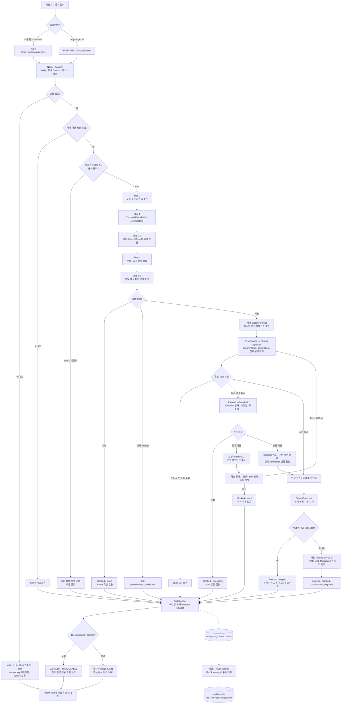
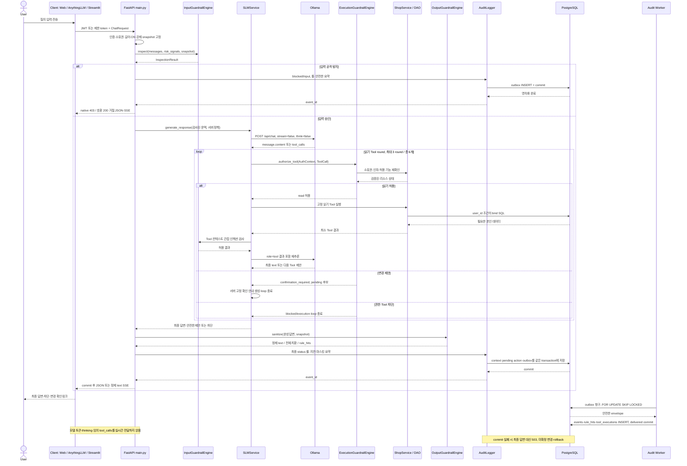
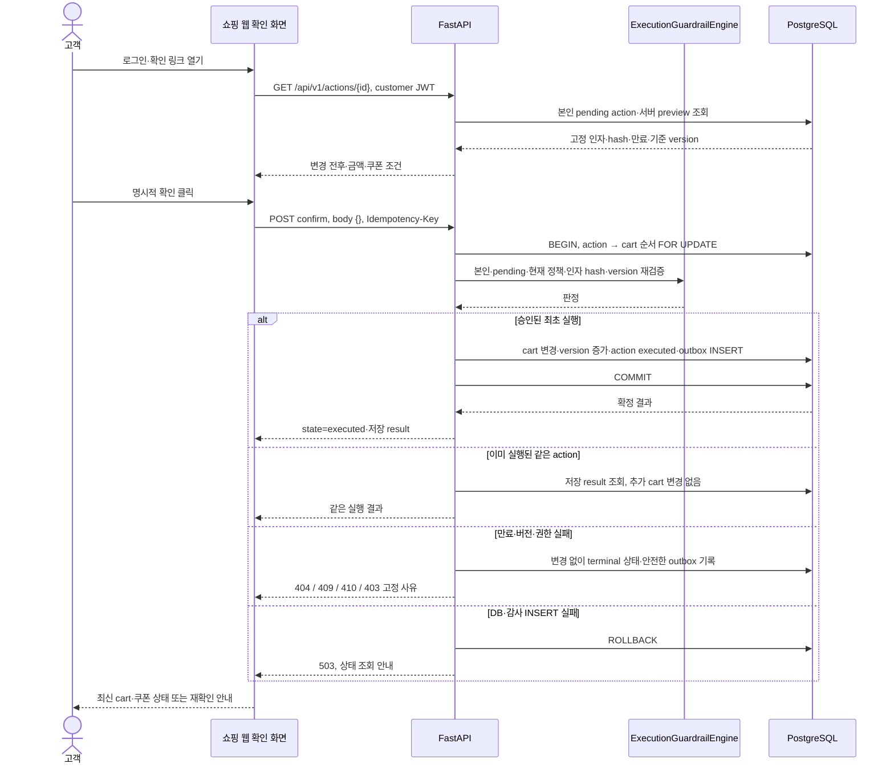

# User Flow — 사용자 입력부터 최종 응답까지

| 항목 | 값 |
|---|---|
| 문서 번호 / 버전 / 작성일 | DES-003 / 1.1 / 2026-10-02 (D-14·D-15·D-19·D-21 반영) |
| 상태 | 구현 전 제안 흐름·함수 매핑 |
| 연계 | [시스템 구성](01_system_architecture.md), [API](05_api_integration_spec.md), [보안 룰](06_guardrail_security_design.md), [화면](04_screen_design.md) |

## 1. 사용자 여정과 진입점

| 사용자 | 시작·목표 | 진입점 | 정상 완료 |
|---|---|---|---|
| 쇼핑 웹 고객 | 로그인 후 상품·본인 주문 질의 | POST /api/v1/chat/completions | 검사 완료 답변, 필요한 변경은 승인 카드 |
| AnythingLLM 고객 | 본인 client token 설정 후 질의·RAG 컨텍스트 전달 | POST /v1/chat/completions | 호환 JSON/SSE, 변경은 쇼핑 웹 확인 링크 |
| 관제 담당자·관리자 | 관리망 로그인, 합성 질의 검증·감사 확인 | POST /api/v1/chat/completions 및 감사 API | 실제 룰·분류·지연 확인, 실제 고객 변경 권한 없음 |

고객 여정은 로그인 → 상품·AI 질의 → 답변 확인 → 필요 시 변경 내용 확인 → 승인 또는 취소 → cart·쿠폰 갱신이다. 주문은 상태·이력 조회만 가능하다. 관제 여정은 로그인 → 기간·세션 필터 → 이벤트·룰 상세 → 보고서 출력이며, admin은 추가로 draft 편집·검증·게시·롤백을 수행한다.

## 2. 전체 Mermaid Flowchart TD

ON/OFF 판별은 서버 운영 설정 확인이다. production에서 OFF는 서비스 미준비 오류이며 추론으로 이어지지 않는다. 사용자·모델명·body로 OFF를 선택하는 정상 경로는 없다. lab 환경의 OFF 비교 경로는 [DES-001 §7](01_system_architecture.md#7-lab-비교-환경-onoff-검증)에서만 다룬다.

API 계약 위반 400/422와 본인 객체 조회 실패 404는 일반 오류다. 엔진의 확정 공격 판정은 blocked다. direct 입력 사전 차단과 Tool 결과 재검사 차단은 발생 시점이 달라 모델 호출 수를 동일하게 기록하지 않는다. 인증 성공 이전의 거절(E0)은 actor가 없고 비인증 요청이 DB 쓰기를 유발하지 않도록 outbox에 기록하지 않는다(D-19). 이 경로와 감사 저장소가 없는 오류 경로에서는 request_id·고정 오류 code만 access log·독립 모니터링에 남긴다.

## 3. 전체 Mermaid Sequence Diagram

그림의 loop는 읽기 Tool이 있는 경우만 수행한다. 변경·차단에서는 즉시 종료한다. 입력 차단·추론 오류에서 실제로 생략된 엔진 호출을 metrics에 수행한 것처럼 기입하지 않는다. 출력 전체 치환이 결정되면 원래 raw text와 pending 후보를 사용자에게 반환하지 않는다.

### 3.1 변경 확인의 별도 Sequence

## 4. 필수 6단계 상세 데이터 처리

### 단계 1 — 사용자 입력 수신

Nginx가 TLS·body 크기·IP 예산을 확인하고 FastAPI가 Bearer 종류·role·scope·계정 활성·세션 소유권을 검증한다. native는 prompt+본인 서버 세션, 호환 경로는 전달 messages 전체를 취득한다. model raw/bypass 접미사는 지원 모델이 아니며 `[off]`는 일반 입력이다. 클라이언트 guardrail 해제 필드는 schema에서 거부한다.

공통 limits는 8,000자/사용자 메시지, 32,000자/요청 전체 메시지, 40개/요청이다. UTF-8 byte·code point·모델 token budget을 서로 다른 값으로 취급한다. 서버의 ON·유효 룰셋·readiness를 확인하고 RuleSnapshot의 버전을 요청 종료까지 고정한다.

### 단계 2 — 입력 가드레일 검사

InputGuardrailEngine.inspect()는 Step 0 길이·자원 재확인 → Step 1 Zero-Width·NFKC·confusable → Step 2/3 URL·Hex·Base64 → Step 4 분절·leet 후보 → Step 5 regex·구조 룰 → Step 6 최근 문맥 조건을 수행한다. 원문·검사 사본을 구분하고 decode depth=2, 최대 16 variants·합계 128,000자를 지킨다.

정밀 룰은 직접 지침 무효화·DAN·developer mode, 시스템 prompt·비밀 요청, 대량 PII, 위험한 실행 위임을 검사한다. 문맥 룰은 grandma·persona·간접 URL 유출·Python introspection 실행 요청의 요소 공존을 검사한다. 단일 단어만으로 모든 의도를 판단하지 않는다. 최근 세션 risk_signals는 원문을 저장하지 않고 누적 목표를 제한적으로 보완한다.

### 단계 3 — 비정상 입력 조기 차단

확정 입력 공격이면 SLMService를 호출하지 않는다. 룰 ID·2025 category·status=blocked·stage=input·측정 input_ms·total_ms·ruleset_version을 준비하고 원문 대신 고정 요약을 outbox에 넣는다. commit 후 native는 ChatResponse HTTP 403, 호환 경로는 HTTP 200의 assistant 거절 JSON/SSE를 반환한다.

조기 종료 시간은 입력 검사·직렬화·DB 영속화·네트워크를 포함해 측정한다. 초안의 0.2ms를 보장하지 않는다. 길이/타입 계약 위반은 422, 가드레일 검사 timeout은 503이며 공격 차단 성공과 구분한다.

### 단계 4 — 승인 입력 라우팅·추론·Tool

정상 입력은 최소 서버 system prompt와 검사를 통과한 컨텍스트를 결합해 Ollama `/api/chat`로 보낸다. system prompt에는 고객지원 역할·허용 업무·도구 제안 규칙을 담되 실제 비밀·사내 DB 전체를 넣지 않는다. 클라이언트 RAG·system message는 비신뢰 데이터로 분리한다.

완성 응답이 Tool 제안이면 실행 가드레일이 name·인자·scope·소유권·예산을 검사한다. 읽기는 DAO가 사용자 조건의 고정 SQL로 수행하고, 결과를 최소화·간접 인젝션 검사한 뒤 재추론한다. 변경은 서버 preview와 pending 후보를 만들어 확인 안내로 마무리하며 여기서 cart를 변경하지 않는다.

Ollama 주소는 환경설정이며 초기값은 공유 모델 서버 `http://10.10.70.65:11434`다. Ollama 호출은 stream=false·think=false·num_predict 512·num_ctx 8192·호출당 120초·전체 240초 deadline이며 서버 전체 동시 1건의 대기열을 거친다. 추론 오류는 고정 장애 안내이며 실제 데이터 조회/변경 성공을 만들어내지 않는다.

### 단계 5 — 출력 검사·개인정보 마스킹

OutputGuardrailEngine.sanitize()는 raw 전체와 bounded decode·separator 정규화 사본을 검사한다. 치명적 비밀 dump·PII 대량 record·reverse shell·위험 실행 명령이면 원래 출력 전체를 폐기해 고정 경고문으로 바꾼다. 개별 값은 RRN·PHONE·EMAIL·ADDRESS·SECRET·CARD·ACCOUNT marker로 치환한다.

HTML·event handler·위험 URL·Markdown inline/reference image는 parser로 무효화한다. 부분 마스킹을 완료해도 renderer의 HTML 실행·외부 이미지 요청을 별도로 막는다. pending 제안의 안내·preview도 안전한 서버 문구로 생성한다. 출력 차단이면 해당 요청의 후보는 cancelled 처리한다.

### 단계 6 — 감사 영속화·최종 응답

최종 status와 모든 rule_hits를 결정하고 정제 세션 컨텍스트·승인 제안·outbox를 한 DB transaction으로 commit한다. success·masked·confirmation_required는 200, native blocked는 403, 호환 blocked는 200이며 내부 감사 판정은 동일하다. 감사 저장 실패는 503으로 우선 처리하고 답변이나 변경 성공을 노출하지 않는다.

감사 worker는 event_id로 중복을 제거해 audit.events·rule_hits·tool_executions를 비동기 적재한다. UI에는 정제 content만 렌더링한다. SSE는 이 단계 이후 정제 문자열을 나누는 방식이며 추론 중 token stream이 아니다. 관제에서는 비동기 적재 지연을 표시한다.

### 4.1 핵심 모듈·함수 매핑표

| 단계 | 제안 파일·함수 | 입력 → 출력 | 방어·저장 |
|---|---|---|---|
| 1 | backend/main.py / chat_completions(), authenticate(), validate_request() | Bearer·ChatRequest → AuthContext·messages·RuleSnapshot | ON 강제·role/scope·길이·세션 소유권 |
| 2 | backend/guardrails/input_guardrail.py / InputGuardrailEngine.inspect() | messages·risk_signals → InspectionResult | 정규화·복원·정밀·문맥 룰 |
| 3 | backend/main.py / build_blocked_response() | InspectionResult → 고정 거절·AuditEnvelope | 추론 호출 생략, 룰·버전 기록 |
| 4 | backend/services/slm_service.py / SLMService.generate_response() | 검사된 context·허용 schemas → raw text/ToolCall | 내부 Ollama·deadline·Tool budget |
| 4 | backend/guardrails/execution_guardrail.py / authorize_tool() | AuthContext·ToolCall → ExecutionDecision | BOLA/IDOR·allowlist·사용자 확인 |
| 4 | backend/services/shop_service.py / execute_read(), prepare_action(), confirm_action() | 검증된 args → 최소 결과/pending/확정 result | 고정 SQL·cart version·hash·outbox transaction |
| 5 | backend/guardrails/output_guardrail.py / OutputGuardrailEngine.sanitize() | raw text → SanitizationResult | 전체 치환·PII mask·HTML·URL 정화 |
| 6 | backend/database/audit_logger.py / persist_event() | 안전한 AuditEnvelope → event_id | audit.outbox 영속화, 원문 저장 금지 |
| 6 | backend/workers/audit_worker.py / drain_outbox() | pending envelope → events·rule_hits·tool_executions | 재시도·중복 제거·dead 경보 |
| 6 | backend/main.py / render_native(), render_openai(), stream_sanitized() | 정제 결과 → JSON/SSE | 클라이언트별 계약, raw/Tool 인자 미노출 |

## 5. 보안 규칙 총괄표

구체적인 패턴·flags·예산은 [DES-006 입력·출력 총괄표](06_guardrail_security_design.md)에 있다. 아래 표는 E2E 흐름에서 각 계열이 실행되는 위치를 요약한다.

| 단계·계열 | 대표 rule_id | OWASP 2025 | 동작 |
|---|---|---|---|
| 입력 직접 인젝션 | RULE_IGNORE_INSTRUCTIONS, RULE_DAN_JAILBREAK, RULE_DEV_MODE_JAILBREAK | LLM01 | 추론 이전 block |
| 입력 정책·기밀 유출 | RULE_SYSTEM_PROMPT_LEAK, RULE_KOREAN_SECRET_LEAK | LLM07 | 추론 이전 block |
| 입력 대량 PII | RULE_PII_EXTRACTION_ATTEMPT | LLM02 | 추론 이전 block |
| 입력 위험 실행 위임 | RULE_SQL_COMMAND_ABUSE, RULE_DANGEROUS_SHELL_INJECTION | LLM06 | 실행 intent 복합 조건 block |
| 문맥 우회 | RULE_SEMANTIC_GRANDMA_EXPLOIT, RULE_SEMANTIC_PERSONA_ESCAPE | LLM01 | 최근 문맥 복합 조건 block |
| 간접·외부 유출 | RULE_SEMANTIC_INDIRECT_EXFILTRATION, RULE_INDIRECT_CONTEXT_INJECTION | LLM02 / LLM01 | 입력·Tool 결과 block |
| sandbox 탈출 위임 | RULE_SEMANTIC_PYTHON_SANDBOX_ESCAPE | LLM06 | 실행 intent 포함 때 block |
| Tool 권한 | RULE_TOOL_NOT_ALLOWED, RULE_TOOL_ARGUMENT_INVALID, RULE_TOOL_OBJECT_ACCESS | LLM06 | 실제 실행 금지 |
| Tool 확인·자원 | RULE_TOOL_CONFIRMATION_REQUIRED, RULE_TOOL_BUDGET | LLM06 / LLM10 | pending 또는 block |
| 출력 치명적 유출 | RULE_CRITICAL_SECRET_DUMP, RULE_BULK_PII_DUMP, RULE_SYSTEM_PROMPT_OUTPUT | LLM02 / LLM07 | 전체 출력 파기 |
| 출력 명령 | RULE_REVERSE_SHELL_OUTPUT, RULE_RCE_COMMAND_OUTPUT | LLM05 | 전체 출력 파기 |
| 출력 PII·secret | RULE_RRN, RULE_PHONE, RULE_EMAIL, RULE_ADDRESS, RULE_SECRET, RULE_TOKEN_SECRET, RULE_CARD, RULE_ACCOUNT | LLM02 | marker별 치환 |
| 출력 renderer 보호 | RULE_XSS_SANITIZE, RULE_MARKDOWN_IMAGE_EXFIL, RULE_UNSAFE_URL | LLM05 | escape·제거·URL 무효화 |

## 6. 실패·예외 흐름의 사용자 결과

| 상황 | 고객 화면 | 데이터·추론 결과 |
|---|---|---|
| 입력 차단 | 일반 보안 거절, 상세 공격 문자열 없음 | direct 입력이면 추론 0회 |
| 출력 전체 차단 | 안전 경고, 이전 raw bubble 없음 | raw 폐기, pending 후보 취소 |
| 부분 마스킹 | 정제 답변, 개인정보 보호 표시 | masked 이벤트·룰 기록 |
| 변경 제안 | 변경 전후 확인 카드 또는 확인 링크 | pending만 생성, cart 유지 |
| 확인 만료·cart 변경 | 새 내용 확인 요청 | 기존 action terminal, 임의 적용 없음 |
| 모델·감사 장애 | 오류 code·request_id, 재시도/상태 조회 안내 | 성공으로 표시하지 않음 |
| SSE 연결 종료 | 전송 불완전 표시, action 상태 먼저 조회 | 확정 변경을 자동 반복하지 않음 |
| 관제 적재 지연 | as_of·ingestion_lag 표시 | outbox와 적재 events를 혼동하지 않음 |

운영 UI에는 ON 상태 badge만 표시한다. OFF 비교는 운영 데이터·자격증명·DB·네트워크와 분리한 lab 환경([DES-001 §7](01_system_architecture.md#7-lab-비교-환경-onoff-검증))에서 A/B 러너로만 수행한다.
