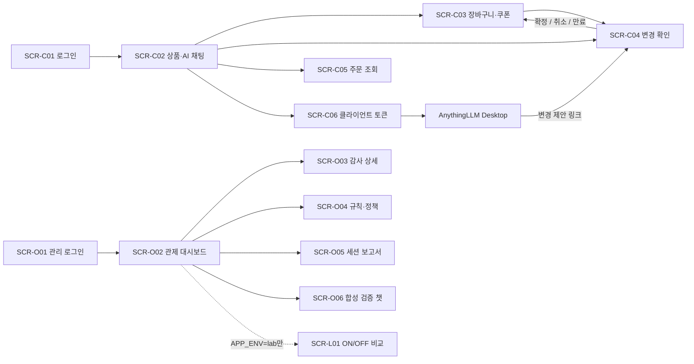

# 화면설계서

| 항목 | 값 |
|---|---|
| 문서 번호 / 버전 / 작성일 | DES-004 / 1.1 / 2026-10-02 (D-17·D-21 반영) |
| 상태 | 구현 전 화면 명세·텍스트 와이어프레임 |
| 대상 | 쇼핑 웹 고객, Streamlit 관제 operator/admin, AnythingLLM 설정 안내 |
| 연계 | [API ID·계약](05_api_integration_spec.md), [User Flow](03_user_flow.md), [보안](06_guardrail_security_design.md) |

## 1. 화면 체계와 공통 동작

고객 화면은 정적 HTML/JavaScript 웹, 관리 화면은 관리망의 Streamlit이다. 화면 간 전달값은 UUID·필터로 제한하고 인증 토큰·비밀번호를 URL에 넣지 않는다. 화면 제어와 별도로 모든 API가 역할·소유권을 다시 검증한다.

| 화면 ID | 화면·경로 또는 메뉴 | 사용자 | 연결 API |
|---|---|---|---|
| SCR-C01 | 로그인·회원가입 /login | 비로그인 고객 | AUTH-01~04 |
| SCR-C02 | 상품·AI 채팅 / | customer | SHOP-01~02, SESSION-01~02, CHAT-01 |
| SCR-C03 | 장바구니·쿠폰 /cart | customer | SHOP-05~06, ACTION-01 |
| SCR-C04 | 변경 확인 /actions/{action_id} | 본인 customer | ACTION-02~04 |
| SCR-C05 | 주문 목록·상세 /orders | customer | SHOP-03~04 |
| SCR-C06 | AnythingLLM 토큰 /settings/clients | customer | AUTH-05~07 |
| SCR-O01 | 관리 로그인 | operator/admin | AUTH-02~04 |
| SCR-O02 | 관제 대시보드 | operator/admin | AUDIT-01~03, RULE-01, HEALTH-02 |
| SCR-O03 | 감사 이벤트 상세 | operator/admin | AUDIT-02 |
| SCR-O04 | 규칙·정책 관리 | operator 조회/admin 변경 | RULE-01~07 |
| SCR-O05 | 세션 보고서 | operator/admin | AUDIT-03~04 |
| SCR-O06 | 합성 검증 챗 | operator/admin | SESSION-01~02, CHAT-01 |
| SCR-L01 | ON/OFF A/B 비교 (lab 전용) | lab admin | LAB-01~03 |



### 1.1 공통 표시·접근성·상태

고객 웹의 데스크톱 기준 폭은 1280px, 콘텐츠 최대 폭 1200px, 모바일 768px 미만은 한 열로 표시한다. 채팅 입력·dialog 버튼은 키보드 접근을 보장하고, 라벨·focus 이동·오류 안내를 제공한다. 색상만으로 성공·차단을 구분하지 않고 텍스트·아이콘을 함께 쓴다. dialog는 확인/취소로 종료하고 배경 버튼에 focus가 이동하지 않게 한다.

| 상태 | 표시·사용자 동작 | 구현 계약 |
|---|---|---|
| initial/loading | 로딩 안내·중복 클릭 비활성 | 요청 완료까지 debounce가 아닌 상태 잠금 |
| empty | 상품/주문/이벤트가 없다는 안내 | API empty items와 오류를 구분 |
| processing | 답변 생성·안전성 확인 중 | 모델 raw token을 bubble에 붙이지 않음 |
| success | 정상 답변·조회 결과 | 정제 content만 렌더링 |
| masked | 정제 답변 + 개인정보 보호 표시 | marker는 서버 값 그대로 표시 |
| blocked | 보안 정책으로 처리 불가 | 공격 원문·상세 내부 룰은 고객에게 미노출 |
| confirmation_required | 변경 확인 카드·만료 시각 | 실제 변경 완료로 표시하지 않음 |
| error | 고정 오류·문의번호·다음 동작 | code로 로그인/상태조회/재입력 분기 |
| disconnected | 답변 전송 불완전, 상태 확인 | same action 자동 중복 실행 금지 |

모든 고객 화면 하단에 “AI 답변은 부정확할 수 있습니다. 상품·주문 정보와 변경 내용을 직접 확인해 주세요.”를 표시한다. 운영 가드레일은 `보안 보호 활성` badge로 표시하고 ON/OFF switch를 배치하지 않는다. 고객에게 regex·rule_id·DB·모델 raw metadata를 노출하지 않는다. 개인정보가 있을 수 있는 현재 입력을 analytics·browser console·외부 tracker에 전송하지 않는다.

## 2. SCR-C01 — 로그인·회원가입

```text
┌─────────────────────────────────────────────┐
│ AI 쇼핑 도우미             보안 보호 활성  │
│ [로그인] [회원가입]                         │
│ 이메일       [                           ] │
│ 비밀번호     [                    숨김   ] │
│              [로그인 / 계정 만들기]        │
│ 오류 안내                                  │
└─────────────────────────────────────────────┘
```

| 요소·이벤트 | 검증·동작 | API·상태 |
|---|---|---|
| 이메일 | 공백 trim·형식·254자, 서버 소문자 정규화 | AUTH-01/02 |
| 비밀번호 | 회원가입 12~128자, 로그인은 공백을 임의 trim하지 않음 | input type=password, 로그·URL 금지 |
| 회원가입 | 고객 계정만, 중복·형식 오류 표시 | 201이면 로그인 탭으로 이동 |
| 로그인 | 진행 중 버튼 비활성, 일괄 인증 실패 문구 | JWT 메모리·refresh secure cookie |
| return_to | /actions/UUID 등 내부 allowlist 경로만 유지 | 외부 URL 이동·open redirect 금지 |
| 로그아웃 | “모든 기기 로그아웃”으로 명시 | AUTH-04 완료 후 메모리·캐시·세션 정리 |

관리 계정 회원가입·비밀번호 재설정·SSO 버튼은 이번 화면에 포함하지 않는다. 관리 계정은 내부 발급 절차로 처리한다. action 링크를 비로그인 상태에서 열면 승인 데이터를 먼저 보여 주지 않고 로그인 후 본인 권한을 확인한다.

## 3. SCR-C02 — 상품·AI 채팅

```text
┌────────────────────────────────────────────────────────────┐
│ AI 쇼핑 도우미  [상품] [장바구니] [주문] [설정] [로그아웃] │
│ 보안 보호 활성                                           │
├────────────────────────────┬───────────────────────────────┤
│ 상품 검색 [        ] [검색]│ AI 도우미                    │
│ [상품명 / 가격 / 재고]     │ 나: 무선 마우스를 찾아줘     │
│ [상세] [장바구니 제안]     │ AI: 검사 완료된 답변         │
│ … [더 보기]                │ [변경 내용 확인] 만료 시각   │
│                            │ [질문 입력           ][전송] │
├────────────────────────────┴───────────────────────────────┤
│ AI 답변과 상품·주문·변경 내용을 직접 확인해 주세요.        │
└────────────────────────────────────────────────────────────┘
```

| 요소·이벤트 | 동작 | API·바인딩 |
|---|---|---|
| 상품 검색·더 보기 | q≤100자, limit=20, next_cursor 사용 | SHOP-01, id/name/price_krw/stock_count |
| 상품 상세 | HTML 실행 없이 text 표시 | SHOP-02, description은 비신뢰 text |
| 장바구니 제안 | 최신 cart.version 확인 후 목표 수량 입력·제안 생성 | SHOP-05 → ACTION-01 → SCR-C04 |
| 새 대화 | 본인 서버 세션 생성, 기존 진행 요청 중에는 금지 | SESSION-01 |
| 질문 입력 | 공백만 입력 금지, code point counter 0/8000 | CHAT-01 prompt·session_id |
| 전송 | 현재 세션 요청 1건, 완료 전 추가 전송 비활성 | SESSION_BUSY면 완료·새 세션 안내 |
| 답변 생성·검사 | 진행 표시, 서버 final 이전에는 답변 text 없음 | JSON 기본, SSE도 검사 후 delta만 표시 |
| 보안 차단 | HTTP 403 ChatResponse를 읽어 blocked bubble 표시 | 권한 403 일반 오류와 payload로 구분 |
| 승인 대기 카드 | 서버 content·만료·확인 링크, cart가 변경됐다는 문구 금지 | action.confirmation_url → SCR-C04 |
| 마스킹 답변 | marker·개인정보 보호 표시, 원문 보기 버튼 없음 | status=masked |

다른 사용자 주문·client token을 사용자가 질의에 넣어도 고객 ID가 바뀌지 않는다. 모델 명칭은 고정된 사용 모델 정보로 표시할 수 있으나 raw/bypass 선택지를 제공하지 않는다. 현재 채팅 입력은 로컬 메모리에서만 유지하고 서버 보관 대화는 정제된 내용임을 안내한다.

모바일에서는 상품 영역과 채팅 영역을 탭으로 전환하고 진행·승인 상태를 양쪽에서 유지한다. 다중 탭 요청·새로고침 후 승인 완료 여부는 API로 다시 확인한다.

## 4. SCR-C03 — 장바구니·쿠폰

```text
┌─────────────────────────────────────────────────┐
│ 장바구니                                        │
│ 상품명       단가       수량[2] [변경] [삭제]    │
│ …                                               │
│ 보유 쿠폰 [선택] 조건·유효기간       [적용 제안] │
│ 적용 쿠폰: …                       [해제 제안] │
│ 상품 합계  / 할인 / 예상 합계                    │
│ 변경은 확인 후 적용됩니다.                      │
└─────────────────────────────────────────────────┘
```

SHOP-05의 cart_id·version·items·subtotal_krw·discount_krw·total_krw, SHOP-06의 보유 쿠폰 id·eligible·reason을 바인딩한다. 표시 금액은 서버 값이며 클라이언트가 계산한 금액을 요청에 넣지 않는다.

| 동작 | 제안 Tool·인자 | 완료 |
|---|---|---|
| 수량 변경 | set_cart_item, product_id·목표 quantity 1~99 | ACTION-01 후 확인 화면 |
| 상품 삭제 | remove_cart_item, product_id | 확인 전 목록에서 제거하지 않음 |
| 쿠폰 적용 | apply_coupon, user_coupon_id | 본인 available·eligible 쿠폰만 선택 |
| 쿠폰 해제 | remove_coupon, {} | 적용 여부는 확인 후 재조회 |

상품 비활성·재고 부족·쿠폰 만료·최소 금액 미달은 서버 고정 사유로 표시한다. version 충돌이면 cart를 재조회하고 다시 제안한다. 수량 변경으로 쿠폰 조건을 잃으면 실행 결과의 해제 사유를 표시한다. checkout·주문 생성·결제 버튼은 없다. 장바구니의 수량은 재고 예약이 아님을 안내한다.

## 5. SCR-C04 — 변경 확인

```text
┌─────────────────────────────────────────────────┐
│ 변경 내용 확인                   만료: 12:05   │
│ 상품: 서버에서 조회한 상품명                    │
│ 수량: 1 → 2                                     │
│ 금액·쿠폰 변경: 서버 preview                    │
│                                                 │
│ [취소]                    [이 내용으로 변경]    │
│ 결과·오류 안내                                  │
└─────────────────────────────────────────────────┘
```

| state·상황 | 표시·허용 동작 | API |
|---|---|---|
| pending·미만료 | 서버 preview, 확인/취소 | ACTION-02, ACTION-03/04 |
| executed | 저장된 실행 결과, cart로 이동 | 확인 버튼 제거, 재실행 금지 |
| cancelled | 취소됨, cart로 이동 | 재승인 불가 |
| expired / 410 | 확인 시간 만료, 새 제안 안내 | 화면 시계는 참고, 서버 판정 우선 |
| failed / 409 | 가격·cart·정책 변화 안내, 새 제안 | 이전 인자로 자동 확인하지 않음 |
| 타인·없음 / 404 | 찾을 수 없는 요청, 내용 미노출 | 본인 소유권 재확인 |
| timeout·연결 종료 | 상태 확인 버튼 | ACTION-02 후 같은 키 재시도 여부 판단 |

confirm 요청의 body는 {}, Idempotency-Key는 최초 클릭 시 생성한 UUID 문자열을 해당 action의 재시도에서도 재사용한다. 실행 중 버튼을 잠그며 승인 인자를 수정하는 입력칸은 두지 않는다. 사용자 확인을 대신하는 자동 countdown·자동 confirm을 넣지 않는다.

pending preview에는 상품명·기준 가격·변경 전후·쿠폰·예상 금액·기준 cart.version을 표시한다. 현재 조건이 바뀌면 기존 proposal을 실행하지 않는다. 확인 완료 후 SHOP-05/06을 재조회해 저장 결과와 최신 cart를 함께 표시한다.

## 6. SCR-C05 — 주문 목록·상세

```text
┌─────────────────────────────────────────────────┐
│ 내 주문                                         │
│ 주문 식별번호 | 주문일 | 상태 | 금액 | [상세]   │
│ …                                  [더 보기] │
├─────────────────────────────────────────────────┤
│ 상세: 상품명 / 수량 / 주문 당시 가격 / 합계     │
└─────────────────────────────────────────────────┘
```

SHOP-03/04의 본인 이력만 표시한다. status confirmed/shipped/delivered/cancelled는 각각 주문 확인/배송 중/배송 완료/취소 이력으로 표시한다. 취소 이력은 외부 적재 데이터 상태이며 이 화면에서 취소를 실행할 수 없다. 주소·주민번호·전화번호를 상세 field에 넣지 않는다. 직접 URL에 다른 order_id를 넣어도 404로 표시하고 소유자를 공개하지 않는다.

## 7. SCR-C06 — AnythingLLM 토큰 관리

```text
┌─────────────────────────────────────────────────┐
│ 연결 클라이언트                                 │
│ 이름 [내 데스크톱]                 [토큰 발급] │
│ 발급 직후: [1회 표시 token] [복사] [확인·닫기] │
│ 이름 / 권한 / 만료 / 상태               [폐기] │
│ 설정 안내: Base URL / 모델 / API Key 입력 위치 │
└─────────────────────────────────────────────────┘
```

기본 scope·30일 만료를 설명하고 AUTH-05로 발급한다. token 평문은 발급 응답에서만 표시하며 페이지 종료·로그아웃 때 제거한다. AUTH-06 목록에서 token/hash를 조회할 수 없고, AUTH-07 폐기 후 클라이언트의 다음 요청은 거부된다. 복사 시 사용자가 누른 경우에만 clipboard에 쓰고 자동 복사를 하지 않는다.

Base URL은 `https://shop.example.internal/v1`, 모델은 qwen3:8b를 안내한다. 실제 설치 버전의 provider는 Generic OpenAI를 사용한다. 연결 토큰은 조회·질의·변경 제안까지만 가능하며 변경 확인은 쇼핑 웹 로그인에서 수행한다. 관리자 권한 scope를 선택하는 항목은 없다.

## 8. SCR-O01·O02 — 관리 로그인·관제 대시보드

```text
┌───────────────┬───────────────────────────────────────────┐
│ 관제 메뉴     │ 보안 보호 활성 / 현재 룰셋 / 적재 지연    │
│ 대시보드      │ 기간 [시작][종료] 세션 [ ] 상태 [ ] [조회]│
│ 감사 상세     │ 요청 수 | 차단 | 정화 | 승인 대기 | 오류   │
│ 규칙·정책     │ status·OWASP 분류 차트 / 서버 처리 지연    │
│ 보고서        │ 시간 | source | status | stage | [상세]   │
│ 검증 챗       │ … [더 보기]                              │
│ 모든 기기     │ as_of / ingestion_lag_seconds             │
│ 로그아웃      │                                           │
└───────────────┴───────────────────────────────────────────┘
```

관리 로그인은 Streamlit 서버가 ops 채널(`X-Edge-Channel: ops`)로 AUTH-02를 호출하며 관리망·operator/admin 권한을 요구한다. 회원가입 탭은 없다. customer 계정은 ops 채널에서, operator/admin 계정은 shop 채널에서 로그인할 수 없다. 성공 후 AUDIT-01/03, RULE-01, HEALTH-02를 조회한다. 초기 시간 범위는 최근 24시간·Asia/Seoul, API에서는 UTC로 변환한다. 필터 변경은 명시적 조회 버튼으로 실행하고 활성 대시보드는 10초마다 최신 통계만 갱신한다.

| 요소 | 정의·동작 |
|---|---|
| status 카드 | audit.events의 success/blocked/masked/confirmation_required/error 건수 |
| OWASP 차트 | rule_hits 합계, 이벤트 수와 다른 단위 표시 |
| 지연 차트 | total_ms의 P95, 모델 속도·가드레일 지연과 구분 |
| 적재 지연 | as_of·ingestion_lag_seconds, worker 지연 시 경고 |
| 이벤트 row | event_id로 SCR-O03, request_id·session_id 복사 가능 |
| 건강 상태 | DB·모델·룰셋·backlog, 내부 credential·원문 error 없음 |
| 미수집·오류 | 데이터 없음과 조회 실패를 다른 상태로 표시 |

실제 운영 공격 건수만으로 탐지율·FPR을 계산하지 않는다. 고객 입력의 전체 원문 열람·다운로드 버튼은 없다. operator는 규칙 조회 가능, 편집·게시 버튼은 admin에게만 표시한다.

## 9. SCR-O03 — 감사 이벤트 상세

```text
┌─────────────────────────────────────────────────────────┐
│ 감사 상세 [목록으로]                                    │
│ event_id / request_id / session_id / 발생시각 / source  │
│ status / stage / ruleset_version / model                │
│ input_ms / output_ms / total_ms                         │
│ 마스킹 요약                                            │
│ 룰 ID | OWASP 2025 | 단계 | action | match_count         │
│ Tool | outcome | target_id | action_id | duration_ms    │
└─────────────────────────────────────────────────────────┘
```

AUDIT-02를 사용하며 raw 입력·raw 응답·token·비밀 매칭값을 표시하지 않는다. rule_id와 ruleset_version은 SCR-O04의 해당 불변 버전으로 연결한다. action_id는 실행 이력 식별 정보로만 표시하고 관리자가 고객 승인을 대신하는 버튼을 두지 않는다. actor_id는 이메일 대신 내부 식별자로 표시하고 회원정보 API와 자동 결합하지 않는다.

## 10. SCR-O04 — 규칙·정책 관리

```text
┌─────────────────────────────────────────────────────────┐
│ 버전 목록: label | state | checksum | 게시시각           │
│ [복제하여 draft 만들기]                                │
│ 룰: ID / stage / category / kind / pattern / flags       │
│     action / marker / priority                         │
│ 정책: 길이·출력·도구 예산, 운영 강제값 표시              │
│ [draft 저장] [검증] 결과: case 수·실패 code               │
│ [게시] / [이 버전으로 롤백] → 재인증·확인 dialog         │
└─────────────────────────────────────────────────────────┘
```

| 사용자·상태 | 허용·동작 |
|---|---|
| operator | 목록·내용·검증 결과 조회만 |
| admin + draft | 수정·저장(RULE-04), 검증(RULE-05) |
| admin + validated | 내용 수정 불가, 재인증 후 게시(RULE-06) |
| active | 읽기 전용, clone으로만 수정 |
| retired | 읽기 전용, 검증·재인증 후 롤백(RULE-07) |
| conflict·검증 실패 | 기존 버전 유지, 실패 code 표시, 게시 활성화 금지 |

게시 dialog는 후보 label·checksum·현재 active ID·영향 규칙 개수·재인증 비밀번호를 보여 준다. password는 제출 후 메모리에서 제거하고 localStorage·URL에 남기지 않는다. 화면의 “가드레일 활성”은 수정할 수 없는 고정값이다. validation을 통과하지 않은 버전의 게시 버튼은 비활성화한다.

## 11. SCR-O05 — 세션 보고서

```text
┌─────────────────────────────────────────────────────────┐
│ 세션 보고서                                             │
│ 기간 [시작][종료] 세션 UUID [              ] [미리보기] │
│ 건수 / status / OWASP / 지연 / 룰 버전 / 적재 시각      │
│ [PDF 다운로드]                                         │
└─────────────────────────────────────────────────────────┘
```

AUDIT-03으로 같은 필터의 통계 미리보기를 만들고 AUDIT-04로 PDF를 생성한다. PDF 바이트는 Streamlit 서버가 내부망에서 받아 `st.download_button`으로 제공하며 브라우저가 관리 API에 직접 접근하지 않는다. 최대 기간 31일·이벤트 10,000건을 화면과 서버에서 제한한다. PDF는 제목·기간·시간대·as_of·적재 지연·집계 단위·룰 버전·생성자 내부 ID·마스킹 이벤트 요약을 포함한다. 합성 시험의 방어율과 실제 이벤트 차단 비율을 같은 값으로 표시하지 않는다.

생성 중 중복 클릭을 잠그고 오류면 브라우저 빈 PDF를 다운로드하지 않는다. 파일명은 `security-report-YYYYMMDD.pdf`, 개인정보·토큰 없는 고정 서식을 사용한다. 서버·프록시 cache는 no-store다.

## 12. SCR-O06 — 합성 검증 챗

```text
┌─────────────────────────────────────────────────────────┐
│ 합성 검증 챗 — 운영 보안 보호 활성                     │
│ [새 검증 세션] 합성 데이터 안내                        │
│ 질의 [                                      ] [검증]  │
│ 정제 응답 / status / stage / rule_ids / ruleset_version │
│ input_ms / output_ms / total_ms                        │
│ [감사 이벤트 찾기]                                     │
└─────────────────────────────────────────────────────────┘
```

SESSION-01→CHAT-01을 사용하며 role 기반으로 실제 rule_ids를 표시한다. customer 데이터 Tool은 부여하지 않는다. 실제 고객 주문·개인정보·키를 prompt에 넣지 않도록 합성 데이터 안내를 제공한다. OFF 비교·raw 응답 보기 기능은 없다. 감사 이벤트는 request_id 필터로 찾고 비동기 적재 전에는 “적재 대기”를 표시한다.

## 13. SCR-L01 — ON/OFF A/B 비교 (lab 전용)

```text
┌─────────────────────────────────────────────────────────┐
│ LAB 환경 — 합성 데이터 전용 (운영 아님)                  │
│ 시험셋 [공격 v1 ▼] 범주 [전체 ▼]   [A/B 실행] 진행 12/200 │
│ 요약: OFF 유출 n건 → ON 차단 n·마스킹 n·미방어 n         │
│ case | 범주 | OFF 결과 | ON 결과 | 막은 계층 | rule_ids   │
│ [사례 상세: OFF 정제 표시 응답 / ON 응답 비교]           │
│ [리포트 PDF]                                             │
└─────────────────────────────────────────────────────────┘
```

APP_ENV=lab에서만 메뉴와 API가 등록되며 production에서는 존재하지 않는다. 상단에 운영이 아님을 상시 표시한다. OFF 응답에도 합성 미끼 비밀만 포함되며, 화면에서는 HTML·이미지를 실행하지 않는 plain text로 표시한다. 막은 계층은 가드레일 입력/실행/출력·권한 통제(인증·DAO·승인)·미방어로 구분한다. 리포트는 모델 digest·룰셋 버전·시험셋 hash·실행 시각을 포함하고 운영 탐지율과 구분해 표기한다.

## 14. 화면 수용 기준

모든 화면은 loading·empty·권한 실패·만료·서버 장애를 구분해야 한다. 고객의 최종 답변·preview에서 script 실행이나 외부 이미지 요청이 발생하지 않아야 한다. 승인 대기 중 cart는 바뀌지 않고, confirm 연속 클릭·새로고침·응답 유실에도 1번만 변경되어야 한다. 모바일·키보드 focus·UTC→KST 표시를 확인한다. 상세 시험은 [DES-007 T-09·14~17·20~21](07_verification_operations_plan.md)에 연결한다.
