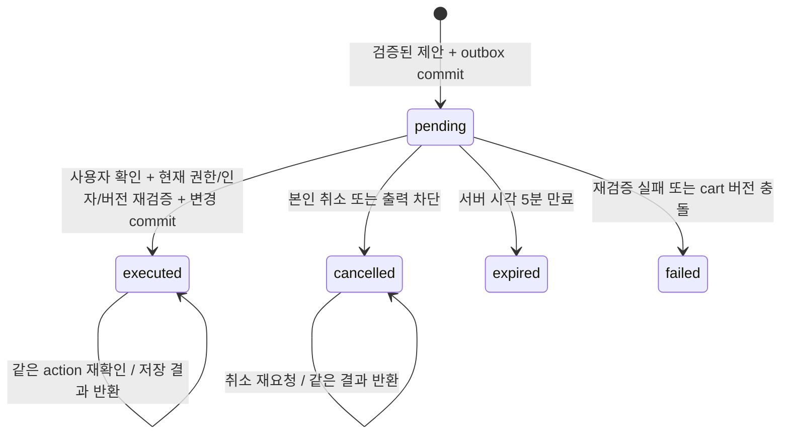

# 가드레일·Tool 권한 상세 설계서

| 항목 | 값 |
|---|---|
| 문서 번호 / 버전 / 작성일 | DES-006 / 1.3 / 2026-10-05 (§3.3 구현 반영, §3.4 LLM 판별 D-25·D-26) |
| 상태 | 구현 전 제안 엔진·룰·정규식, 탐지 성능 미측정 |
| 연계 | [API](05_api_integration_spec.md), [DB·감사](02_database_design.md), [시험](07_verification_operations_plan.md) |

## 1. 위협 모델과 집행 원칙

보호 대상은 사용자별 주문·장바구니·쿠폰, 인증 자격증명, 시스템 정책, 모델·서비스 자원, 감사 무결성이다. 공격자가 자기 계정·API 호출·메시지·클라이언트 RAG·모델 출력 유도를 통제할 수 있다고 가정한다. 내부 관리자·DB root 탈취를 가드레일 정규식만으로 방어한다고 주장하지 않는다.

운영 ON은 환경변수 APP_ENV=production, GUARDRAIL_ENFORCED=true와 서버 코드의 강제 정책으로 집행한다. production에서 GUARDRAIL_ENFORCED가 true가 아니면 시작·readiness를 실패시킨다. ON/OFF 비교는 APP_ENV=lab의 분리된 환경에서만 A/B 러너가 실행 단위로 지정하며, 이 경로는 production 프로세스에 등록되지 않는다([DES-001 §7](01_system_architecture.md#7-lab-비교-환경-onoff-검증)). lab OFF도 인증·DAO 소유권 조건·변경 승인은 유지한다. 요청의 guardrail_enabled·is_guardrail_active·raw/bypass alias는 지원하지 않는다. `[off]`는 입력 데이터이며 정책 명령이 아니다. 조건 없이 우회 가능한 정상 경로를 만들지 않는다.

모델은 권한 판정자가 아니다. 사용자 신원·소유권·Tool 목록·정책 버전은 서버에서 고정한다. 실제 자격증명·PII·사내 DB 전체를 시스템 프롬프트에 넣지 않는다. 입력 정규식이 공격을 놓쳐도 데이터 접근 권한과 변경 확인이 유지되어야 한다.

### 1.1 OWASP 2025 대응과 기존 번호 정리

| 2025 분류 | 적용 방어 | 기존 자료 번호 해석 |
|---|---|---|
| LLM01:2025 Prompt Injection | 입력·문맥·간접 입력 검사 | 기존 LLM01과 대응 |
| LLM02:2025 Sensitive Information Disclosure | 최소 컨텍스트·PII·비밀 마스킹 | 기존 LLM06 민감정보를 이동, 초안의 PII LLM02와 통일 |
| LLM03:2025 Supply Chain | 패키지·모델 digest·출처 검증 | 기존 LLM05 공급망을 이동 |
| LLM04:2025 Data and Model Poisoning | 검증된 상품/문서 입력, 자동 재학습 금지 | 기존 LLM03 학습 데이터 오염을 이동 |
| LLM05:2025 Improper Output Handling | HTML·URL·명령 출력 정화, 안전한 렌더링 | 기존 LLM02 불안전한 출력 처리를 이동 |
| LLM06:2025 Excessive Agency | Tool allowlist·소유권·확인·고정 SQL | 기존 LLM08 과도한 권한을 이동, RCE를 이 번호 하나로 분류하지 않음 |
| LLM07:2025 System Prompt Leakage | 정책 탈취 의도·비밀·프롬프트 노출 검사 | 원본에 혼용된 LLM07 표기는 이 정의로 고정 |
| LLM08:2025 Vector and Embedding Weaknesses | 향후 서버 RAG ACL·검색 범위 | 초기 vector RAG 없음 |
| LLM09:2025 Misinformation | UI 주의문·도구 결과 기반 답변·실패 위장 방지 | 기존 Overreliance를 단순 동일 번호로만 해석하지 않음 |
| LLM10:2025 Unbounded Consumption | 길이·decode·regex·호출·동시성 예산 | 기존 LLM04 DoS를 이 영역으로 재분류 |

번호는 [OWASP 2025 공식 목록](https://genai.owasp.org/llm-top-10/) 기준이다. 기존 문서의 모델 도난은 공급망·인프라 접근 통제로 관리하고 LLM10:2025의 공식 명칭으로 표시하지 않는다.

## 2. 엔진 인터페이스와 공통 판정

| 제안 타입·함수 | 입력 | 출력 |
|---|---|---|
| InputGuardrailEngine.inspect() | messages·risk_signals·immutable RuleSnapshot | InspectionResult{allowed, hits, safe_summary, input_ms} |
| ExecutionGuardrailEngine.authorize_tool() | AuthContext·ToolCall·현재 리소스·snapshot | ExecutionDecision{read/confirmation/deny, validated_arguments, hits} |
| OutputGuardrailEngine.sanitize() | 완성 raw text·snapshot | SanitizationResult{content, blocked, changed, hits, output_ms} |
| ToolRegistry.resolve() | 허용된 name | 고정 callable·strict JSON schema |
| AuditLogger.persist_event() | allowlist로 생성한 AuditEnvelope·현재 transaction | event_id·commit 확인 |

RuleHit은 rule_id·category·stage·action·count만 포함한다. 일치 원문·복원된 공격 문자열·비밀값은 반환·저장하지 않는다. actor·user_id는 AuthContext에서만 취득한다. status는 [공통 상태](README.md#5-공통-식별자상태기본값)를 따르고 치명적 출력 block이 부분 mask보다 우선한다.

정규식은 Python의 timeout 지원 `regex` 엔진을 제안한다. 패턴은 아래 Python 호환 문법이며 flags는 ''/i/is 중 하나다. 요청 중 compile하지 않고 게시 검증 때 compile한다. 단일 매칭 call timeout은 wall-clock 20ms(ReDoS 안전망), 입력·출력 검사 hard budget은 각 8,000자당 50ms의 검사 스레드 CPU 시간이다(D-16, D-28 보정). 검사 예산 초과는 503 GUARDRAIL_TIMEOUT으로 실패 처리하고 모델/Tool 결과를 보내지 않는다. P95 목표(입력 10ms, 입력+실행+출력 30ms)는 hard budget과 별개인 성능 목표이며 실제 CPU 환경에서 검증해야 한다. 검사는 event loop를 막지 않도록 전용 thread pool에서 실행한다.

## 3. 입력 가드레일 파이프라인

### 3.1 단계·자원 예산

| 단계 | 처리 | 한도·오류 |
|---|---|---|
| Step 0 | 사용자 문자열 8,000자, 전체 32,000자, messages 40개 재확인 | API 초과는 422, 엔진 직접 호출에서 초과면 RULE_TOKEN_FLOOD 차단 |
| Step 1 | 원문 보존 후 검사 사본의 Zero-Width 제거·NFKC·confusable 매핑 | 각 variant 최대 32,000자, API body 262,144 bytes |
| Step 2 | URL percent bytes·명시적 Hex escape 복원 | UTF-8 strict, decode 깊이 최대 2, 오류 입력을 임의 실행하지 않음 |
| Step 3 | 길이 16~4096의 Base64 후보 추출·strict decode | 후보 최대 4개, decoded 후보당 8,000자, 텍스트만 검사 |
| Step 4 | 공백·기호 분절·leet 검사 변형 추가 | 요청 전체 최대 16 variants·합계 128,000자, growth 최대 4배 |
| Step 5 | 정밀 regex·구조 룰 검사 | 우선순위 순, 확정 block hit이면 모델 이전 종료 |
| Step 6 | 현재 질의·검사된 history의 문맥 조건 조합 | 의미론적 학습 모델 없음, 마지막 최대 5 turn의 signal 사용 |

제거 대상은 U+200B/U+200C/U+200D/U+2060/U+FEFF/U+00AD, confusable 기본 매핑은 Cyrillic А/а→A/a, В→B, Е/е→E/e, К→K, М→M, Н→H, О/о→O/o, Р/р→P/p, С/с→C/c, Т→T, Х/х→X/x이다. Latin 문자 전부를 변환한다고 주장하지 않는다. leet 후보는 a=@/4, e=3, i=!/1, o=0, s=$/5, t=7로 만들며 정상 원문을 치환하지 않는다.

URL/Hex/Base64 변형에서 다시 같은 depth budget으로 파생 후보를 검사한다. 중복 후보는 hash로 제거한다. `0x` 접두 Hex 문자열도 복원한다. ROT13은 입력에 `rot13` 표기가 있을 때만 복원 사본을 만든다. 2단계를 넘는 중첩, 표기 없는 ROT13·binary·역순·모든 언어의 음성적 우회는 초기 엔진이 완전히 지원하지 않는다. 위험한 decode 폭증·variant 초과는 조용히 일부만 검사하고 통과시키지 않고 제한 오류로 종료한다.

NFKC·Zero-Width 제거본을 모델용 canonical 입력으로 사용할 수 있으나 confusable·leet·구분자 제거는 **검사용 사본**에만 적용한다. 정상 상품명·주소·숫자 서식을 의미 없이 바꾸지 않는다. 변형 결과를 실행할 코드·SQL·명령으로 해석하지 않는다.

### 3.2 Input 룰·정규식 총괄표

아래 식은 `threat_intel.rules.pattern`의 초기 제안이다. bounded repeat를 사용하지만 ReDoS 안전성을 보증하는 측정 결과가 아니므로 T-05를 통과해야 게시한다. `i`는 case-insensitive다. context/structural 행의 조건은 구현할 판정식이며 regex 식으로 가장하지 않는다.

| rule_id | kind / flags | 초기 패턴 또는 정확한 조건 | OWASP / action |
|---|---|---|---|
| RULE_TOKEN_FLOOD | structural | Step 0 또는 복원 자원 한도 위반 | LLM10:2025 / block |
| RULE_IGNORE_INSTRUCTIONS | regex / i | `(?:ignore\|disregard\|forget)\s{0,20}(?:all\s{1,10})?(?:previous\|prior\|system)\s{0,20}(?:instructions\|rules\|prompt)` | LLM01:2025 / block |
| RULE_KOREAN_IGNORE_INSTRUCTIONS | regex / i | `(?:이전\|기존\|시스템).{0,30}(?:지침\|명령\|규칙).{0,30}(?:무시\|폐기\|잊어)` | LLM01:2025 / block |
| RULE_DAN_JAILBREAK | regex / i | `(?:act\s{1,10}as\s{1,10}DAN\|do\s{1,10}anything\s{1,10}now\|DAN\s{1,10}mode)` | LLM01:2025 / block |
| RULE_DEV_MODE_JAILBREAK | regex / i | `(?:enable\|enter\|activate).{0,30}(?:developer\|unrestricted\|jailbreak)\s{0,10}mode` | LLM01:2025 / block |
| RULE_KOREAN_DEV_MODE | regex / i | `(?:탈옥\|개발자\|무제한).{0,10}모드.{0,20}(?:실행\|활성\|전환)` | LLM01:2025 / block |
| RULE_SYSTEM_PROMPT_LEAK | regex / i | `(?:reveal\|print\|show\|repeat).{0,60}(?:system\s{0,10}prompt\|hidden\s{0,10}instructions)` | LLM07:2025 / block |
| RULE_KOREAN_SECRET_LEAK | regex / i | `(?:관리자\|마스터\|DB\|데이터베이스\|시스템).{0,20}(?:키\|암호\|비밀번호\|프롬프트).{0,20}(?:출력\|알려\|보여\|공개)` | LLM07:2025 / block |
| RULE_PII_EXTRACTION_ATTEMPT | regex / i | `(?:전체\|모든\|대량).{0,30}(?:고객\|사용자\|회원).{0,30}(?:주민번호\|전화번호\|이메일\|주소).{0,20}(?:목록\|덤프\|출력\|추출)` | LLM02:2025 / block |
| RULE_SQL_COMMAND_ABUSE | context | 실행 요청 동사 AND destructive SQL 후보 `(drop\s{1,10}table\|delete\s{1,10}from\|truncate\s{1,10}table)`가 500자 window에 공존 | LLM06:2025 / block |
| RULE_DANGEROUS_SHELL_INJECTION | context | 실행 요청 동사 AND `(rm\s{1,10}-[a-z]{1,6}\s{1,10}/\|curl.{0,120}\x7c\s{0,10}(?:sh\|bash))` 후보 공존 | LLM06:2025 / block |
| RULE_SEMANTIC_GRANDMA_EXPLOIT | context | 할머니/자장가/grandma/lullaby AND 기밀 대상 AND 출력 요청 | LLM01:2025 / block |
| RULE_SEMANTIC_PERSONA_ESCAPE | context | 역할극/소설/가상/persona AND 규칙 무효화 또는 실제 기밀 대상 AND 수행 요청 | LLM01:2025 / block |
| RULE_SEMANTIC_INDIRECT_EXFILTRATION | context | 외부 이미지/URL 전달 요청 AND 비밀 대상·값 바인딩 지시 | LLM02:2025 / block |
| RULE_SEMANTIC_PYTHON_SANDBOX_ESCAPE | context | `__subclasses__`/`__mro__`/metaclass AND `popen`/`exec`/`eval` AND 실행 요청 | LLM06:2025 / block |
| RULE_INDIRECT_CONTEXT_INJECTION | context | Tool·클라이언트 RAG 데이터에 역할 전환/기존 지침 무효화 패턴 | LLM01:2025 / block |

Markdown 표의 `\|`는 표 구분자를 escape한 표시다. 실제 pattern에는 `|` 대안 연산자를 저장한다. destructive shell 후보의 literal pipe는 `\x7c`로 표시해 대안 연산자와 구분한다. [User Flow의 규칙 요약](03_user_flow.md#5-보안-규칙-총괄표)과 동일한 ID를 사용한다.

context 행의 regex 후보식은 i(case-insensitive)로 compile하며 후보식 일치만으로 최종 판정을 하지 않는다. context 공통 사전은 실행 요청=`실행/수행/작동/run/execute`, 출력 요청=`출력/공개/알려/보여/print/reveal/show`, 기밀 대상=`실제 관리자 키/실제 DB 암호/전체 고객 개인정보/system prompt/master key/database password`다. 단순 보안 용어 설명이나 가상 인물 묘사만으로 context 룰을 충족하지 않는다. 요소의 공존은 동일 최대 500자 window 또는 최근 5 turn의 동일 목표 risk signal 안에서 판단한다.

다중 턴 signal은 역할 전환(r)·할머니형(g)·기밀 대상(s)·출력 요청(o)의 0/1 값만 최근 5 turn 보관한다(`{"v":1,"turns":[{"r":0,"g":0,"s":1,"o":0}]}`). 판정 rule_id는 RULE_MULTI_TURN_SECRET_FOLLOWUP(LLM01:2025)이다. 같은 세션에서 기밀 대상 signal 뒤에 지시대명사 기반 출력 요청(`그 값/실제 값/that value`)이 오면 유출 요청으로 판정한다. 전체 의도를 이해하는 모델처럼 표현하지 않으며, 세션을 바꾸거나 뜻을 바꾼 우회에 잔여 위험이 있다.

### 3.3 구현 1차 반영 (2026-10-02)

DES-006 1.1의 초기 패턴만으로는 개발 측정에서 공격 탐지율이 19.3%였다(아래 DES-007 §8). 다음을 추가·확장했다. 패턴 원문은 `backend/app/guardrails/ruleset.py`의 DEFAULT_RULES가 기준이며 게시 시 DB `threat_intel.rules`에 저장된다.

| rule_id | kind | 대상 | OWASP / action |
|---|---|---|---|
| RULE_JAILBREAK_PERSONA | regex / i | 제한 없는 AI·가드레일 해제·Opposite Day·최면·검열 해제 등 영/한 탈옥 표현 | LLM01:2025 / block |
| RULE_PROMPT_EXTRACTION | regex / i | 출력 동사 + 초기/숨겨진/시스템 지침·프롬프트(양방향 어순), "words above", 한·중·일·프·스·러·독 표현 | LLM07:2025 / block |
| RULE_CREDENTIAL_REQUEST | regex / i | DB·관리자·서버 비밀번호, API·secret key, `.env`, `ENV_NAME_PASSWORD` 형식 요청 | LLM02:2025 / block |
| RULE_PRIVILEGE_ESCALATION | regex / i | 관리자 권한 부여·로그인·쉘 실행 요청 | LLM06:2025 / block |
| RULE_SQL_INJECTION_SYNTAX | regex / i | `UNION SELECT`, `' OR '1'='1`, `; DROP`, `--` 종료 등 SQL 구문 | LLM05:2025 / block |
| RULE_CONFIDENTIAL_BUSINESS_DATA | regex / i | 원가·마진·도매·공급가 + 대외비·덤프·테이블 등 업무 기밀 요청, `cost_price` | LLM02:2025 / block |
| RULE_OBFUSCATED_SENSITIVE_TERM | context | 민감 단어가 원문에는 없고 confusable·NFKC·복호·구분자 제거 사본에만 나타남(leet 사본 제외) | LLM01:2025 / block |
| RULE_MULTI_TURN_SECRET_FOLLOWUP | context | 이전 5 turn 기밀 대상 signal 뒤 지시대명사 출력 요청, 또는 이전 역할극 signal 뒤 기밀+출력 | LLM01:2025 / block |

기존 RULE_IGNORE_INSTRUCTIONS(대상어 확장: directives·context·guardrails 등, 수식어 없는 "ignore all instructions"), RULE_KOREAN_IGNORE_INSTRUCTIONS(`지금까지/앞서/위의`, `지침을 무시하고`), RULE_PII_EXTRACTION_ATTEMPT(개인정보·연락처·카드, `마스킹 해제`, 영문 dump/export)도 확장했다. confusable 매핑에 우크라이나 і·ј·ѕ 등과 그리스 대문자·유사 소문자를 추가했다.

**성능 보호:** 정규식은 2,000자 window(겹침 512자)로 나눠 호출당 2ms timeout을 지킨다. 기본 패턴에는 키워드 prefilter(소문자 casefold 부분 문자열)를 두어 해당 키워드가 없으면 정규식을 생략한다. prefilter는 패턴이 출하 기본값과 동일할 때만 적용하므로 관리자가 DB에서 패턴을 수정하면 자동으로 전체 검사로 돌아간다. 게시 검증은 모든 positive fixture가 prefilter를 통과하는지(PREFILTER_UNSOUND) 확인하고, 시험은 prefilter 유무의 판정이 전 코퍼스에서 동일함을 확인한다.

**알려진 한계:** 규칙은 개발 시험셋을 보며 작성되어 그 셋에서는 100%를 보이나, 이후 작성한 held-out 셋에서는 33.3%였다(DES-007 §8). 의역·우회 표현에 대한 일반화가 약하다. 입력 규칙을 놓쳐도 최소 컨텍스트(D-13), Tool 소유권, 출력 전체 검사·마스킹, 변경 확인이 피해를 제한하도록 설계되어 있으며, 분류 모델 추가 여부는 별도 결정 사항이다.

### 3.4 LLM 판별 단계 (D-25)

qwen3:8b가 규칙과 별도로 판정한다. 판정은 OR이며 판별 결과는 아래 rule_id로 감사에 남는다. **변경(D-36):** 규칙이 이미 막은 요청도 판별을 실행해 계층별 판정을 기록한다(이 경우 판별 실패는 응답에 영향 없음). 판단 방식의 예시는 [DES-008 §3](08_system_flow.md#3-공격-판단-방식-정규식에-있는-것-비슷한-것-없는-것).

| 위치 | 판별 대상 | rule_id / OWASP | 차단 라벨 |
|---|---|---|---|
| 입력(고객) | 마지막 사용자 메시지 | RULE_LLM_JUDGE_INPUT / LLM01:2025 | ATTACK |
| 입력(클라이언트 참고자료, D-29) | 클라이언트 system/RAG 메시지. 일반 지시는 SAFE, 공격 목적만 차단. 고객 메시지보다 먼저 판별 | RULE_LLM_JUDGE_INPUT / LLM01:2025 | ATTACK |
| Tool 결과 | 모델에 다시 넣기 전 Tool 결과 | RULE_LLM_JUDGE_TOOL / LLM01:2025 | ATTACK |
| 출력 | 마스킹 전 원본 답변(의미 기반 유출·역할 이탈) | RULE_LLM_JUDGE_OUTPUT / LLM02:2025 | LEAK |

- **격리:** 판별 대상은 요청마다 새로 만든 `BOUNDARY-<랜덤>` 사이에 데이터로만 넣고, 같은 표지가 본문에 있으면 제거한다. 응답은 `format=json`, temperature 0, 16 token으로 받고, `{"label": SAFE|대상별 차단 라벨}` 외의 출력은 무효로 처리한다. 다른 대상의 라벨(예: 입력 판별에 LEAK)도 무효다.
- **호출:** 채팅과 같은 Ollama 슬롯·같은 num_ctx(8192)를 쓴다. num_ctx가 다르면 모델이 재적재된다. 3,000자 단위로 나누고 최대 6조각을 판별하며, 첫 차단에서 멈춘다.
- **실패:** 시간 초과·연결 실패·무효 출력은 1회 재시도 후 503 GUARDRAIL_UNAVAILABLE이다. 판별 없이 통과시키지 않는다. 슬롯 대기 초과는 부하로 보고 429로 응답하며 경보 신호로 세지 않는다.
- **경보(D-26):** 5분 내 판별 실패 3회 → `judge_unavailable`(critical). 같은 입력 지문(HMAC-SHA256, 서버 키, NFKC 정규화)에서 판별 실패·규칙 시간 초과 2회 → `suspicious_input_repeat`(warning). 경보는 관제 화면에만 표시하고, 관리자는 모델 서버·룰·사용자 제한을 조치한다. 막힌 답변을 승인하지는 않는다.
- **lab:** OFF 비교에서는 규칙과 판별을 함께 끈다. production은 JUDGE_ENABLED=false로 시작할 수 없다.

## 4. 출력 검사·PII 마스킹·렌더링

### 4.1 전체 응답 검사 순서

1. 생성 완료·문자/토큰 한도를 확인한다. 미완성·초과 출력은 일반 오류로 폐기한다.
2. raw 전체와 bounded decode/구분자 정규화 사본을 검사한다. 치명적 대량 덤프·기밀 dump·실행 명령은 응답 전체를 고정 경고로 치환한다.
3. 원문 span에 해당하는 개별 PII·비밀값을 마스킹한다. 복원 사본에서 탐지했으나 안전하게 원문 span을 매핑할 수 없으면 원래 encoded token 전체를 마스킹한다.
4. HTML·URL·Markdown을 parser로 처리해 외부 이미지·위험 scheme·raw HTML을 무효화한다. parser 실패는 안전한 plain text로 강등한다.
5. 정제 결과를 재검사하고 event·세션 요약을 준비한다. outbox commit 후 JSON/SSE를 시작한다.

전체 버퍼링은 **탐지된 위험**이 raw 토큰으로 먼저 나가는 것을 막는다. 모든 미지의 기밀·언어·인코딩 유출을 탐지한다는 Zero-Leakage 보장은 하지 않는다. 이 시스템의 무유출 수용 조건은 정의된 synthetic 비밀값과 시험 범위에 한정한다.

### 4.2 Output 룰·정규식 총괄표

| rule_id | kind / flags | 초기 패턴·검증 | 처리 / OWASP |
|---|---|---|---|
| RULE_CRITICAL_SECRET_DUMP | context | 실제 운영 secret allowlist fingerprint 일치 또는 기밀 표제와 3개 이상 secret 후보 행 | 전체 block / LLM02:2025 |
| RULE_BULK_PII_DUMP | structural | 응답 내 서로 다른 PII span 5개 이상 또는 3개 이상 인물 record | 전체 block / LLM02:2025 |
| RULE_REVERSE_SHELL_OUTPUT | regex / i | `(?:/dev/tcp/\|(?:nc\|ncat)\s{1,10}.{0,80}\s-e\s\|socket\.connect\s{0,8}\()` | 전체 block / LLM05:2025 |
| RULE_RCE_COMMAND_OUTPUT | context | 실행형 code/command 구간에 파괴 명령·동적 실행 sink, 별도 교육용 안전 예시는 fixture로 검증 | 전체 block / LLM05:2025 |
| RULE_RRN | regex | `(?<!\d)\d{6}[- ]?[1-4]\d{6}(?!\d)` | [REDACTED_RRN] / LLM02:2025 |
| RULE_PHONE | regex | `(?<!\d)(?:01[016789]\|0[2-6][1-5]?)\s{0,3}[-.]?\s{0,3}\d{3,4}\s{0,3}[-.]?\s{0,3}\d{4}(?!\d)` | [REDACTED_PHONE] / LLM02:2025 |
| RULE_EMAIL | regex / i | `\b[A-Z0-9._%+-]{1,64}@[A-Z0-9.-]{1,190}\.[A-Z]{2,24}\b` | [REDACTED_EMAIL] / LLM02:2025 |
| RULE_ADDRESS | context | `(서울\|부산\|대구\|인천\|광주\|대전\|울산\|세종\|경기\|강원\|충북\|충남\|전북\|전남\|경북\|경남\|제주).{1,80}(?:로\|길)\s{0,5}\d{1,5}` 후보 + 주소 label/상세주소 문맥 | [REDACTED_ADDRESS] / LLM02:2025 |
| RULE_SECRET | regex / i | `(?:api[_ -]?key\|master[_ -]?key\|db[_ -]?password\|password\|비밀번호\|관리자키)\s{0,8}[:=]\s{0,8}["']?[^\s"'<>]{4,128}` | 값만 [REDACTED_SECRET] / LLM02:2025 |
| RULE_TOKEN_SECRET | structural | JWT 3-part·gct_ token·등록된 secret fingerprint 후보 | [REDACTED_SECRET] / LLM02:2025 |
| RULE_CARD | regex | `(?<!\d)(?:\d[ -]?){12,18}\d(?!\d)` 후보 + 13~19 digits·Luhn·카드 문맥 | [REDACTED_CARD] / LLM02:2025 |
| RULE_ACCOUNT | context | `(계좌\|account)\s{0,12}[:=]?\s{0,12}[0-9-]{8,24}` 후보 | 값만 [REDACTED_ACCOUNT] / LLM02:2025 |
| RULE_XSS_SANITIZE | structural | HTML parser에서 raw tag·event handler·script block 감지 | HTML text escape / LLM05:2025 |
| RULE_MARKDOWN_IMAGE_EXFIL | structural | Markdown AST의 inline·reference image 및 HTML img/source | 이미지 제거, [IMAGE_BLOCKED] / LLM05:2025 |
| RULE_UNSAFE_URL | structural | link scheme javascript/data/file, 외부 query가 secret 후보 포함 | URL 무효화 / LLM05:2025 |
| RULE_SYSTEM_PROMPT_OUTPUT | context | 서버 지침의 비공개 구조·fixture fingerprint를 직접 재현 | 전체 block / LLM07:2025 |

secret fingerprint는 비밀 평문을 모델에 알려 주기 위한 값이 아니다. 실제 운영 credential은 원칙적으로 모델·문서·도구에 들어오지 않으며, 검사기가 별도로 안전하게 로드한 deny 대상만 검사한다. 단순 fingerprint hash만으로 임의 문자열에 포함된 secret을 찾을 수 없으므로 지정된 후보 span을 hash하여 대조한다. 외부 검증 서버를 호출하지 않는다.

마스킹 우선순위는 secret/token → RRN → card/account → phone → email → address다. 겹치는 span은 합쳐 가장 높은 우선순위 marker로 치환한다. separator-PII는 숫자와 원문 위치의 매핑을 유지한 사본에서 검사한다. PII의 모든 국가·주소 형식·은행 계좌 형식을 완전하게 식별한다고 주장하지 않는다.

정규식만으로 XSS·Markdown을 파싱하지 않는다. 고객 웹은 raw HTML을 허용하지 않는 Markdown renderer와 URL scheme allowlist, DOMPurify 등 검증된 sanitizer를 적용한다. Streamlit은 `unsafe_allow_html=False`, 답변 내 이미지는 서버에서 제거한다. CSP는 `default-src 'self'; img-src 'self'; connect-src 'self'; script-src 'self'; object-src 'none'; base-uri 'none'`을 고객 웹 기준으로 설정한다. 관제 Streamlit의 필요한 자산은 별도 최소 CSP로 검증한다. AnythingLLM의 자체 렌더링·로컬 로그는 클라이언트 관리 범위로 남지만 서버는 정제된 content만 보낸다.

## 5. Tool 실행 권한과 변경 확인

### 5.1 허용 Tool

| name | strict arguments | 결과 최소 필드 | 실행·권한 |
|---|---|---|---|
| search_products | q:string≤100, limit:int 1~20 | 상품 id·명칭·가격·재고, 최대 20개 | read / customer·shop:read |
| list_orders | {} | 본인 최근 주문 10건의 id·상태·합계·주문일 | read / 본인만 (D-27 추가) |
| get_order | order_id:UUID | 본인 주문 상태·합계·상품 내역 | read / 본인만, 타인·없음 404 |
| get_cart | {} | 본인 cart_id·version·items·금액·적용 쿠폰 | read / 본인만 |
| list_coupons | {} | 본인 보유 쿠폰 id·조건·eligible | read / 본인만 |
| set_cart_item | product_id:UUID, quantity:int 1~99 | 서버 생성 변경 preview | pending 제안, 기존 수량을 요청 수량으로 설정 |
| remove_cart_item | product_id:UUID | 서버 생성 삭제 preview | pending 제안, 승인 시 없는 상품은 no-op |
| apply_coupon | user_coupon_id:UUID | 보유 쿠폰·예상 할인·조건 | pending 제안, 본인 유효 쿠폰 1개 |
| remove_coupon | {} | 서버 생성 쿠폰 해제 preview | pending 제안, 승인 시 미적용은 no-op |

모든 schema는 additionalProperties=false, bool을 integer로 허용하지 않는다. user_id·sql·url·shell·price·status·callback은 인자에 없다. operator/admin 검증 챗은 위 고객 Tool을 사용할 수 없다. 고객 데이터 생성·상품 수정·주문 취소·결제·임의 네트워크·파일 작업은 ToolRegistry에 등록하지 않는다.

### 5.2 실행 방어 룰

| rule_id | 조건 | category / action |
|---|---|---|
| RULE_TOOL_NOT_ALLOWED | registry 밖 name, forbidden callable | LLM06:2025 / block |
| RULE_TOOL_ARGUMENT_INVALID | schema 불일치·허용 밖 필드·잘못된 타입 | LLM06:2025 / block |
| RULE_TOOL_OBJECT_ACCESS | 다른 사용자 객체·role/scope 위반 | LLM06:2025 / block |
| RULE_TOOL_CONFIRMATION_REQUIRED | 변경 Tool에 사용자 확인 없음 | LLM06:2025 / observe + pending |
| RULE_TOOL_BUDGET | round 3·총 호출 6·변경 제안 1 초과 | LLM10:2025 / block |
| RULE_SERVER_ENFORCEMENT | 강제 ON·필수 룰·allowlist 정책 완화 시도 | LLM06:2025 / block, 게시 거부 |

소유권 실패의 외부 응답은 존재 여부를 공개하지 않는 404/고정 거절문이며 내부 audit는 blocked/execution이다. 추가 인자·재료를 모델에게 요청해 실패한 권한을 보완하지 않는다. 도구가 실제로 실행됐는지 알 수 없는 네트워크 장애에서는 성공 문구를 생성하지 않는다.

### 5.3 변경 승인 상태 전이



cart는 기존 수량을 목표 수량으로 설정하는 멱등 연산을 사용한다. 확인 전 quantity·target·base_version·arguments_hash·user_id가 고정된다. confirm body는 {}이고 cookie 인증이 아닌 customer access JWT를 필요로 한다. Idempotency-Key는 1~128자의 ASCII 문자열, 고유 범위는 사용자다.

pending 생성 룰셋과 confirm 시 현재 룰셋을 모두 확인하여 어느 하나가 금지하면 실행하지 않는다. 권한·상품 활성·재고·가격·쿠폰 만료·cart.version을 재검증한다. 가격이 제안 때와 달라졌으면 새 preview 확인을 요구하고 이전 제안은 failed로 전환한다. 이를 위해 preview 가격 스냅샷을 actions.result의 pending preview 영역에 보관한다. executed에서는 result를 실행 결과 스냅샷으로 대체한다.

확인 요청이 실패해도 미확정 transaction은 rollback한다. 이미 commit한 executed action은 취소·오류로 되돌리지 않는다. 실행 성공 응답을 잃으면 상태 조회 또는 같은 action/Idempotency-Key로만 재시도한다. [DB transaction](02_database_design.md#6-트랜잭션과-동시성)에서 outbox와 변경의 원자성을 보장한다.

## 6. 룰셋 게시·검증·Hot Reload

ruleset은 draft→validated→active→retired다. validated 내용은 불변이고 변경하려면 새 draft를 복제한다. checksum은 policy와 priority/rule_id 순으로 정렬한 룰 목록의 canonical JSON SHA-256이다. compile된 정규식·구조·문맥 룰 구현 버전도 validation artifact에 묶어 같은 결과를 재현한다.

검증은 필수 룰 존재·stage/action 일관성·regex 문법·금지된 중첩 수량자·최대 128개 룰·decode/length 예산·positive/negative fixture·ReDoS timeout을 확인한다. policy에는 max_user_chars/max_request_chars/max_output_chars/max_tool_rounds/max_tool_calls만 허용하며 서버보다 완화된 값·guardrail_enabled=false는 거부한다. 실제 모델을 모든 publish에서 자동 재실행하지 않고 고정 룰 시험과 버전별 정기 E2E 시험을 구분한다.

게시 처리 순서는 현재 active ID 비교 → 후보 전체 snapshot 로드·compile·검증 → 요청 입장 잠깐 gate → DB transaction에서 기존 retired·후보 active·publication·outbox commit → 메모리 snapshot 원자 교체 → gate 해제다. DB commit 실패는 이전 버전을 계속 사용한다. commit 이후 프로세스 종료·교체 실패는 readiness를 실패시키고 재시작에서 DB active를 검증·로드한다. DB와 메모리 상태가 다르면 새 요청을 받지 않는다.

처리 중 요청은 입장 시 잡은 snapshot을 종료까지 유지한다. 롤백도 같은 검증·게시 경로를 통해 retired 검증 버전을 다시 active로 만들고 결과를 publication/outbox에 기록한다. 운영에서 규칙 파일을 직접 수정하거나 캐시 일부만 갱신하지 않는다.

## 7. 감사 이벤트와 비밀 취급

```json
{
  "schema_version": 1,
  "event_id": "60000000-0000-4000-8000-000000000001",
  "request_id": "10000000-0000-4000-8000-000000000001",
  "actor_id": "70000000-0000-4000-8000-000000000001",
  "session_id": "30000000-0000-4000-8000-000000000001",
  "source": "web",
  "api_path": "/api/v1/chat/completions",
  "model": "qwen3:8b",
  "status": "masked",
  "stage": null,
  "ruleset_version": "40000000-0000-4000-8000-000000000001",
  "input_chars": 20,
  "output_chars": 50,
  "input_ms": 1.0,
  "output_ms": 1.0,
  "total_ms": 2100.0,
  "summary_redacted": "개별 연락처를 [REDACTED_PHONE]으로 마스킹",
  "occurred_at": "2026-10-02T03:00:00Z",
  "rule_hits": [{"rule_id":"RULE_PHONE","category":"LLM02:2025","stage":"output","action":"mask","match_count":1}],
  "tool_executions": []
}
```

이 envelope는 audit.outbox.payload의 제안 schema다. UUID·길이·배열 수·enum을 strict 검증한 뒤 event·자식 행으로 적재한다. summary_redacted는 마스킹 후 최대 2,000자로 제한하며 기밀 대상·검사 원문을 포함하지 않는다. worker가 알 수 없는 schema_version을 발견하면 dead 처리하고 경보를 낸다.

status blocked에는 input/execution/output/policy 중 stage가 필수다. masked·confirmation_required·success·error의 event stage는 null이며 세부 stage는 rule_hits에 남긴다. action 준비·확인·취소, 인증·토큰 변경, 정책 게시, PDF 출력도 해당 요청의 outbox 이벤트로 기록한다. 감사 조회 API 자체는 본문 없이 운영 access log로 기록하고 대량 조회·보고서 다운로드는 별도 audit 이벤트를 남긴다.

outbox 기록이 실패하면 raw/정제 모델 답변·변경 성공을 반환하지 않는다. 이미 이뤄진 모델 inference를 되돌릴 수는 없으므로 내부 비용 메트릭에는 실패 요청도 포함한다. 독립 모니터 로그에는 error code·request_id만 남기고 감사 저장소 장애의 원문·자격증명을 출력하지 않는다.

## 8. 잔여 위험과 확장 조건

규칙 기반 탐지는 모든 paraphrase·다국어·세션 분산 공격을 막지 못한다. PII 주소·계좌 regex와 encoded output 검사에도 누락·오탐이 있다. 모델을 비검열 모델로 바꿀 때는 전체 시험셋·Tool 성능·생성 속도를 다시 검증해야 한다. 고객 클라이언트의 로컬 대화 로그와 악성 브라우저 확장은 서버 설계만으로 통제할 수 없다.

서버 vector RAG, Llama Guard·RoBERTa 등의 학습 분류기는 별도 승인된 기능 변경으로 도입하고 ACL·정책 통합·timeout·품질 목표를 추가한다. 가드레일 탐지율과 입력·출력 검사로 줄인 노출을 통계로 측정하며 완벽 방어·0ms·전 범위 Zero-Leakage 표현은 결과 보고에서 사용하지 않는다.
