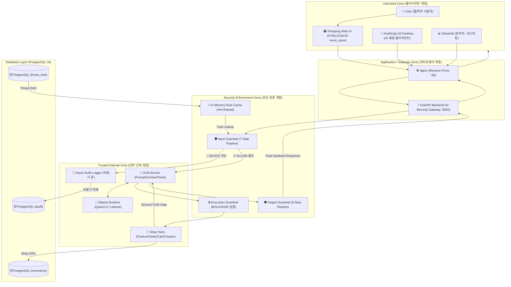

# 시스템 아키텍처 정의서 (ARCHITECTURE.md)

## 1. 아키텍처 개요 (Architecture Overview)

본 시스템은 **OWASP Top 10 for LLM** 위협을 원천 차단하고, E-커머스 업무 환경에서 비즈니스 연속성과 데이터 기밀성을 보장하는 **다계층 AI 보안 게이트웨이(Multi-Tier AI Security Gateway)** 아키텍처입니다.

---

## 2. 보안 구역(Security Zone) 정의

| 구역 명칭 (Zone) | 구성 요소 (Components) | 신뢰 수준 (Trust Level) | 보안 통제 방안 |
| :--- | :--- | :--- | :--- |
| **Untrusted Zone** | User, Mock Store UI, AnythingLLM Desktop | 신뢰 불가 (Zero Trust) | 모든 요청은 Gateway 진입 시 파라미터 유효성 검사 필수 |
| **Gateway Zone** | Nginx Reverse Proxy, FastAPI Gateway | 경계 신뢰 (Boundary) | Rate Limiting, CORS 정책, SSL/TLS, 라우팅 제어 |
| **Security Enforcement Zone** | Input Guardrail, Rule Cache, Execution Guardrail, Output Guardrail | 높은 보안 강도 | 정규식/유니코드 정규화, BOLA 인가 검증, PII 마스킹 |
| **Trusted Internal Zone** | SLM Service, Ollama, Shop Tools, Async Logger | 내부 신뢰 (Internal) | 외부 직접 노출 금지, 내부 Docker Network 격리 |
| **Database Layer** | PostgreSQL 16 (threat_intel, commerce, audit) | 최고 기밀 (Isolated) | 최소 권한 접속 계정 분리, 연결 풀링, SSL 연결 |

---

## 3. 핵심 데이터 및 제어 흐름 (Detailed Request Flow)

### 3.1 AI 요청 처리 흐름 (AI Request Flow)
1. **클라이언트 요청 접수**:
   - AnythingLLM 또는 Mock Store 챗봇이 Nginx를 통해 FastAPI `/v1/chat/completions` 또는 `/api/v1/chat/completions` 호출.
2. **1차 방어선 - Input Guardrail (7단계 파이프라인)**:
   - ① **Request Validation**: JSON 구조 및 필수 필드 검증.
   - ② **Length Validation**: 최대 토큰 및 문자열 길이(예: 2,000자) 초과 여부 검사.
   - ③ **Unicode Normalization**: NFKC 정규화를 통한 호모글리프/특수문자 변형 해제.
   - ④ **Confusable Character Detection**: 키릴 문자, 그리스 문자 등 라틴 알파벳 위장 탐지.
   - ⑤ **De-obfuscation**: Base64, Hex, URL 인코딩 문자열 디코딩 후 숨겨진 악성 페이로드 노출.
   - ⑥ **Threat Signature Matching**: 프롬프트 인젝션, 시스템 지침 무시, 탈옥(Jailbreak), SQLi 시그니처 매칭.
   - ⑦ **Semantic & Persona Enforcement**: 시스템 역할 탈취 및 비인가 도메인 질문 필터링.
   - **[차단 시]**: 즉시 표준 보안 경고 메시지 반환 및 비동기 감사 로거(`AsyncAuditLogger`)로 이벤트 전송.
3. **2차 처리선 - SLM Service & Ground-Truth Context**:
   - 통과된 질의에 대해 시스템 프롬프트 및 사용자 컨텍스트 구성.
   - 필요 시 E-커머스 업무 도구(Tool Calling) 결정.
4. **3차 방어선 - Execution Guardrail (BOLA / IDOR 인가 통제)**:
   - 사용자가 요청한 주문 ID(`order_id`), 고객 ID(`customer_id`)의 소유권 및 권한 검증.
   - 허용되지 않은 관리자 전용 함수 호출이나 악의적 쿼리 파라미터 차단.
5. **4차 처리선 - Shop Tools & Database**:
   - `ShopDAO`를 통해 PostgreSQL `commerce` 스키마 데이터 조회 (상품, 배송, 장바구니 등).
   - 모델에 Ground-Truth(실제 데이터) 주입 및 Ollama 추론 수행.
6. **5차 방어선 - Output Guardrail (5단계 출력 필터링)**:
   - ① **Critical Leak Detection**: 시스템 프롬프트 유출, DB 연결 문자열, 내부 파일 경로 탐지.
   - ② **Reverse Shell Detection**: 리버스 쉘 명령어(`nc -e`, `/bin/bash`, `powershell -enc` 등) 탐지.
   - ③ **PII Detection & Redaction**: 주민등록번호, 카드번호, 전화번호, **대외비 상품 원가(`cost_price`)** 마스킹(`[REDACTED]`).
   - ④ **XSS Sanitization**: 악의적 HTML/스크립트 태그 이스케이프.
   - ⑤ **Markdown & Link Safety**: `javascript:`, 피싱 링크, 안전하지 않은 스키마 차단.
7. **최종 응답 전송**: 검증 및 정제 완료된 안전한 텍스트를 클라이언트에 반환.

---

## 4. 모듈별 책임 및 설계 원칙 (Module Responsibilities)

- **`backend/app/core/`**:
  - `config.py`: Pydantic BaseSettings 기반 환경변수 로딩 및 타입 유효성 검증.
  - `security.py`: 해시 검증, 입력값 안전성 기본 유틸리티.
  - `exceptions.py`: 계층별 일관된 예외 처리 및 보안 안전 응답 매핑.
- **`backend/app/guardrails/`**:
  - `input_guardrail.py`: 순수 함수형 검사 파이프라인으로 구성되어 고속 단독 테스트 가능.
  - `output_guardrail.py`: 정규식 및 패턴 기반 고속 마스킹 및 탐지.
  - `execution_guardrail.py`: 권한 검증 및 파라미터 경계 통제.
  - `rule_manager.py`: DB의 위협 인텔리전스 룰을 메모리에 캐싱하고 Hot-Reload 제공.
- **`backend/app/repositories/`**:
  - `threat_dao.py`: 위협 룰셋 CRUD.
  - `shop_dao.py`: 쇼핑몰 상품, 고객, 주문 트랜잭션 처리.
  - `audit_dao.py`: 보안 감사 로그 배치/단건 적재.
- **`backend/app/services/`**:
  - `slm_service.py`: Ollama API 연동 및 템플릿 프롬프팅.
  - `shop_service.py`: 비즈니스 로직 및 도구 실행 오케스트레이션.
  - `audit_service.py`: 백그라운드 태스크 및 감사 이벤트 발행.
