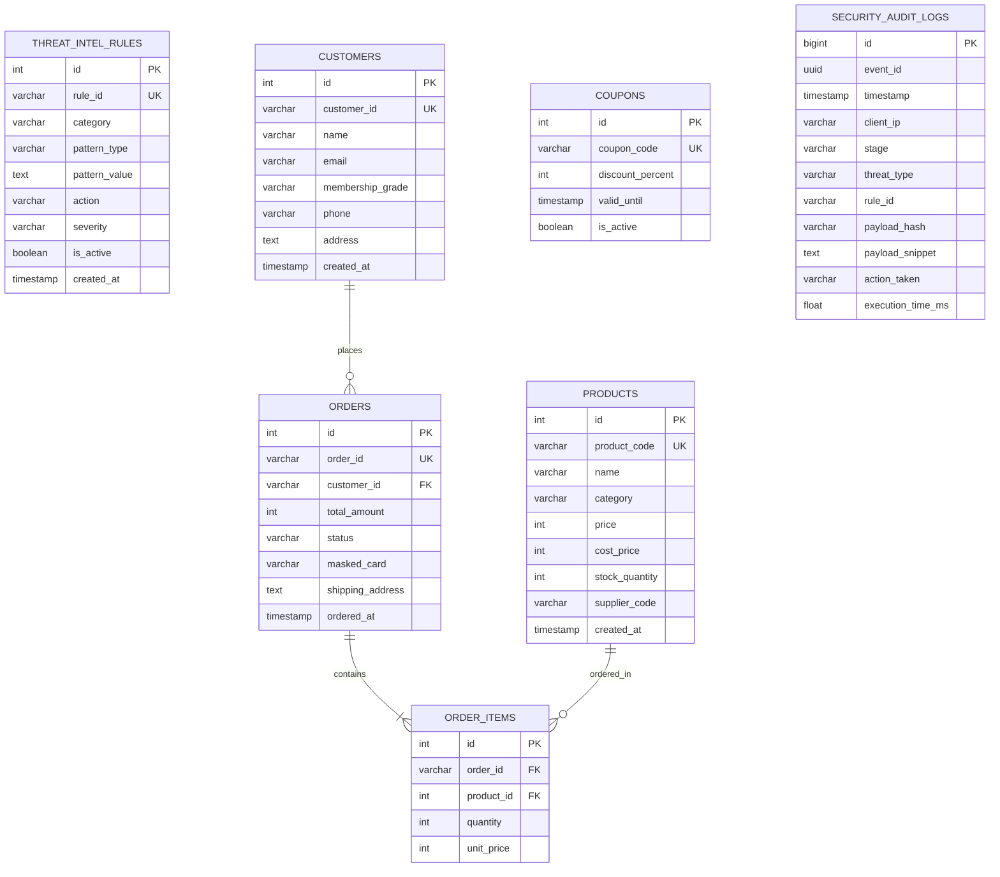

# 데이터베이스 설계서 (DATABASE_DESIGN.md)

## 1. 데이터베이스 개요 (Database Overview)
- **RDBMS**: PostgreSQL 16
- **설계 원칙**:
  1. **논리적 스키마 격리**: `threat_intel`(보안 위협 지능), `commerce`(이커머스 비즈니스 데이터), `audit`(보안 감사 로그) 3대 스키마로 분리하여 데이터 접근 제어 및 결합도 최소화.
  2. **대외비 데이터 보호**: 원가(`cost_price`) 및 결제정보 컬럼은 애플리케이션 레벨의 Execution/Output 가드레일을 통해 일반 사용자 접근 원천 통제.
  3. **고속 조회를 위한 인덱싱**: 룰셋 조회 및 감사 로그 시계열 검색을 위한 최적 인덱스 구성.

---

## 2. 논리 스키마 및 ERD 구조 (Schema Architecture)

---

## 3. 테이블 상세 명세 (Table Specifications)

### 3.1 `threat_intel` 스키마

#### `threat_intel.guardrail_rules` (동적 가드레일 룰셋)
| 컬럼명 | 데이터 타입 | 제약 조건 | 설명 |
| :--- | :--- | :--- | :--- |
| `id` | SERIAL | PRIMARY KEY | 고유 식별자 |
| `rule_id` | VARCHAR(64) | UNIQUE, NOT NULL | 룰 고유 코드 (예: `INJ-001`, `PII-002`) |
| `category` | VARCHAR(32) | NOT NULL | 룰 카테고리 (`INPUT`, `OUTPUT`, `EXECUTION`) |
| `pattern_type` | VARCHAR(32) | NOT NULL | 매칭 유형 (`KEYWORD`, `REGEX`, `HOMOGLYPH`, `SEMANTIC`) |
| `pattern_value` | TEXT | NOT NULL | 실제 매칭 패턴 문자열 또는 정규식 |
| `action` | VARCHAR(16) | NOT NULL | 탐지 시 동작 (`BLOCK`, `REDACT`, `ALERT`) |
| `severity` | VARCHAR(16) | NOT NULL | 위험 수준 (`CRITICAL`, `HIGH`, `MEDIUM`, `LOW`) |
| `is_active` | BOOLEAN | DEFAULT TRUE | 룰 활성화 상태 |
| `description` | TEXT | NULL | 룰 설명 및 방어 대상 위협 |
| `created_at` | TIMESTAMP | DEFAULT NOW() | 생성 일시 |
| `updated_at` | TIMESTAMP | DEFAULT NOW() | 수정 일시 |

- **인덱스**: `idx_guardrail_rules_active (is_active, category)`

---

### 3.2 `commerce` 스키마

#### `commerce.customers` (고객 정보)
| 컬럼명 | 데이터 타입 | 제약 조건 | 설명 |
| :--- | :--- | :--- | :--- |
| `id` | SERIAL | PRIMARY KEY | 고유 식별자 |
| `customer_id` | VARCHAR(64) | UNIQUE, NOT NULL | 고객 비즈니스 ID |
| `name` | VARCHAR(64) | NOT NULL | 고객 성명 |
| `email` | VARCHAR(128) | NOT NULL | 이메일 주소 |
| `membership_grade` | VARCHAR(16) | DEFAULT 'BASIC' | 회원 등급 (`VIP`, `GOLD`, `BASIC`) |
| `phone` | VARCHAR(32) | NOT NULL | 연락처 |
| `address` | TEXT | NOT NULL | 기본 배송지 주소 |
| `created_at` | TIMESTAMP | DEFAULT NOW() | 가입 일시 |

#### `commerce.products` (상품 카탈로그)
| 컬럼명 | 데이터 타입 | 제약 조건 | 설명 |
| :--- | :--- | :--- | :--- |
| `id` | SERIAL | PRIMARY KEY | 고유 식별자 |
| `product_code` | VARCHAR(64) | UNIQUE, NOT NULL | 상품 고유 코드 |
| `name` | VARCHAR(128) | NOT NULL | 상품명 |
| `category` | VARCHAR(64) | NOT NULL | 카테고리 (`TOP`, `BOTTOM`, `SHOES`) |
| `price` | INTEGER | NOT NULL | 일반 소비자 판매가 |
| `cost_price` | INTEGER | NOT NULL | **대외비 원가 (일반 사용자 조회 차단)** |
| `stock_quantity` | INTEGER | NOT NULL DEFAULT 0 | 재고 수량 |
| `supplier_code` | VARCHAR(64) | NOT NULL | 공급사 식별 코드 |
| `created_at` | TIMESTAMP | DEFAULT NOW() | 등록 일시 |

#### `commerce.orders` (주문 마스터)
| 컬럼명 | 데이터 타입 | 제약 조건 | 설명 |
| :--- | :--- | :--- | :--- |
| `id` | SERIAL | PRIMARY KEY | 고유 식별자 |
| `order_id` | VARCHAR(64) | UNIQUE, NOT NULL | 주문 고유 번호 |
| `customer_id` | VARCHAR(64) | NOT NULL | 주문 고객 식별자 |
| `total_amount` | INTEGER | NOT NULL | 총 주문 금액 |
| `status` | VARCHAR(32) | NOT NULL | 주문 상태 (`ORDERED`, `SHIPPED`, `DELIVERED`, `CANCELLED`) |
| `masked_card` | VARCHAR(32) | NOT NULL | 마스킹된 결제 카드 정보 |
| `shipping_address` | TEXT | NOT NULL | 배송지 주소 |
| `ordered_at` | TIMESTAMP | DEFAULT NOW() | 주문 일시 |

---

### 3.3 `audit` 스키마

#### `audit.security_logs` (보안 감사 이벤트)
| 컬럼명 | 데이터 타입 | 제약 조건 | 설명 |
| :--- | :--- | :--- | :--- |
| `id` | BIGSERIAL | PRIMARY KEY | 감사 로그 ID |
| `event_id` | UUID | NOT NULL | 이벤트 고유 추적 UUID |
| `timestamp` | TIMESTAMP | DEFAULT NOW() | 이벤트 발생 일시 |
| `client_ip` | VARCHAR(45) | NOT NULL | 클라이언트 IP (IPv4/IPv6) |
| `stage` | VARCHAR(32) | NOT NULL | 탐지 단계 (`INPUT`, `EXECUTION`, `OUTPUT`) |
| `threat_type` | VARCHAR(64) | NOT NULL | 위협 유형 (예: `PROMPT_INJECTION`, `BOLA_VIOLATION`) |
| `rule_id` | VARCHAR(64) | NULL | 매칭된 룰 식별자 |
| `payload_hash` | VARCHAR(64) | NOT NULL | 입력 페이로드 SHA-256 해시값 |
| `payload_snippet` | TEXT | NULL | 위협 탐지 스니펫 (민감정보 마스킹 후 저장) |
| `action_taken` | VARCHAR(16) | NOT NULL | 조치 결과 (`BLOCKED`, `REDACTED`, `LOGGED`) |
| `execution_time_ms`| FLOAT | NOT NULL | 가드레일 검증 소요 시간 (ms) |

- **인덱스**: `idx_audit_timestamp (timestamp DESC)`, `idx_audit_threat (threat_type)`

---

## 4. 초기 시드 데이터 (Seed Data Plan)
- `threat_intel.guardrail_rules`: 프롬프트 인젝션(15종), 시스템 프롬프트 탈취(10종), 탈옥 키워드(10종), SQLi/XSS(15종), PII 마스킹 정규식(5종) 사전 등록.
- `commerce.products`: 패션몰 기본 상품 5종(오버핏 후드티, 와이드 슬랙스, 베이직 스니커즈, 볼캡, 패딩) 등록 (원가 컬럼 포함).
- `commerce.customers` & `orders`: 권한 및 BOLA 테스트용 모의 고객 3인 및 주문 데이터 등록.
