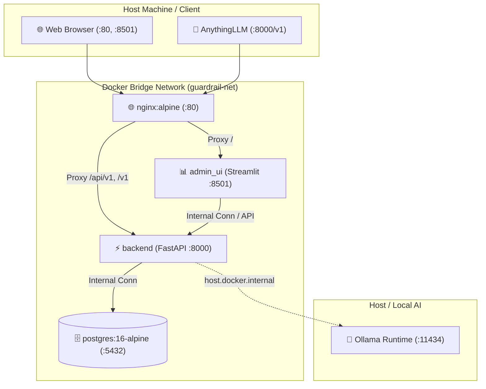

# 배포 및 운영 가이드 (DEPLOYMENT_GUIDE.md)

## 1. 배포 아키텍처 개요 (Deployment Architecture)
본 시스템은 **Docker Compose**를 기반으로 컨테이너화되어 원클릭으로 모든 마이크로서비스(FastAPI Backend, Nginx, PostgreSQL 16, Streamlit Admin UI, Ollama 연동)를 표준화된 가상 격리 네트워크 내에서 구동합니다.



---

## 2. 컨테이너 서비스 명세 (Service Specifications)

| 서비스명 (Service) | 베이스 이미지 | 노출 포트 | 역할 및 특성 |
| :--- | :--- | :--- | :--- |
| **`postgres`** | `postgres:16-alpine` | `5432:5432` | DB 스키마(`threat_intel`, `commerce`, `audit`) 및 영구 볼륨(`pgdata`) |
| **`backend`** | `python:3.12-slim` | `8000:8000` | AI Security Gateway, 가드레일 엔진, REST API |
| **`admin_ui`** | `python:3.12-slim` | `8501:8501` | Streamlit 보안 관제 및 동적 룰셋 관리 대시보드 |
| **`nginx`** | `nginx:alpine` | `80:80` | 리버스 프록시, 정적 웹 서빙(`mock_store`), 트래픽 라우팅 |

---

## 3. 환경 설정 및 구동 방법 (Step-by-Step Guide)

### 3.1 환경변수 파일 준비
프로젝트 루트 디렉터리에 `.env.example` 파일을 복사하여 `.env`를 생성합니다.
```bash
cp .env.example .env
```

### 3.2 Docker Compose 원클릭 실행
```bash
# 컨테이너 빌드 및 백그라운드 실행
docker compose up --build -d

# 실행 상태 및 헬스체크 확인
docker compose ps

# 백엔드 로그 실시간 확인
docker compose logs -f backend
```

### 3.3 서비스 접속 엔드포인트 안내
- **🛍️ 쇼핑몰 웹 UI (Mock Store)**: `http://localhost/` 또는 `http://localhost:80`
- **📊 보안 관제 대시보드 (Streamlit Admin)**: `http://localhost:8501`
- **🔌 FastAPI Swagger API 명세**: `http://localhost:8000/docs`
- **💬 AnythingLLM 연동 Base URL**: `http://localhost:8000/v1`

---

## 4. 로컬 개발 환경 직접 실행 (Without Docker)

Docker 환경 외에 로컬 Python 가상환경에서 직접 실행할 경우:

```bash
# 1. 가상환경 생성 및 활성화
python -m venv .venv
source .venv/bin/activate  # Windows: .venv\Scripts\activate

# 2. 의존성 설치
pip install -r backend/requirements.txt

# 3. 백엔드 FastAPI 서버 실행
cd backend
uvicorn app.main:app --host 0.0.0.0 --port 8000 --reload

# 4. Streamlit Admin 대시보드 실행 (별도 터미널)
cd admin_ui
streamlit run app.py --server.port 8501
```

---

## 5. 운영 보안 체크리스트 (Production Checklist)
1. `.env` 파일이 Git 저장소에 커밋되지 않았는지 확인.
2. PostgreSQL 기본 비밀번호가 강력한 난수로 변경되었는지 확인.
3. Nginx SSL/TLS 인증서가 올바르게 적용되었는지 확인.
4. 컨테이너 리소스 제한(CPU, Memory Limit)이 설정되었는지 확인.
