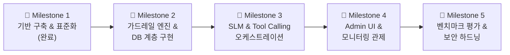

# 개발 로드맵 및 단계별 계획 (DEVELOPMENT_ROADMAP.md)

## 1. 개요 (Overview)
본 문서는 `AI Security Guardrail Chatbot`의 체계적인 개발 및 고도화를 위한 단계별 마일스톤(Milestones)과 우선순위 로드맵을 정의합니다.

---

## 2. 전체 개발 마일스톤 (Milestones)

---

## 3. 단계별 세부 구현 과업

### 🚀 Milestone 1: 기반 아키텍처 및 CI/CD 구축 (현재 단계)
- [x] 신규 프로젝트 디렉터리 및 Git 저장소 초기화.
- [x] 12종 엔지니어링 표준 가이드라인(`docs/engineering/`) 수립.
- [x] Clean Architecture 기반 백엔드/프론트엔드/인프라 기본 구조 생성.
- [x] Docker Compose 및 PostgreSQL 16 멀티 컨테이너 환경 정의.
- [x] GitHub Actions CI 파이프라인(Lint, Type, Test, Security Scan) 구축.
- [x] 로컬 검증 및 Initial Commit.

---

### 🛡️ Milestone 2: 가드레일 엔진 및 PostgreSQL 연동
- [ ] 7단계 Input Guardrail 파이프라인 세부 알고리즘 고도화 (정규식 및 호모글리프 사전 확장).
- [ ] 5단계 Output Guardrail (PII 마스킹, 리버스 쉘 페이로드 차단) 완성.
- [ ] Execution Guardrail (BOLA/IDOR 소유권 검증) 완성.
- [ ] PostgreSQL 16 3대 스키마(`threat_intel`, `commerce`, `audit`) DDL 마이그레이션 적용.
- [ ] `ThreatIntelDAO`, `ShopDAO`, `AuditDAO` 비동기 쿼리 구현 및 커넥션 풀 최적화.
- [ ] In-Memory Rule Cache 및 Hot-Reload 엔드포인트 연동.

---

### 🤖 Milestone 3: SLM 추론 및 Tool Calling 오케스트레이션
- [ ] Ollama 로컬 런타임(`qwen2.5`, `llama3`) 연동 클라이언트 개발.
- [ ] E-커머스 업무 도구(상품 조회, 주문 추적, 장바구니 관리, 쿠폰 적용) Tool Function 구현.
- [ ] AI 모델의 Tool Calling 요청을 파싱하고 Execution Guardrail을 거쳐 실행하는 오케스트레이터 구축.
- [ ] Ollama 오프라인 시 자동 전환되는 Smart Rule Fallback 엔진 연동.
- [ ] AnythingLLM 클라이언트 호환 `/v1/chat/completions` API 완성.

---

### 📊 Milestone 4: 프론트엔드 및 Admin UI 완성
- [ ] `mock_store` 이커머스 웹 UI 개선 및 플로팅 챗봇 연동.
- [ ] Streamlit 기반 보안 관제 대시보드 구축:
  - 실시간 보안 감사 로그 시각화 (공격 유형별 차트, 시간대별 빈도).
  - 동적 가드레일 룰셋 실시간 추가, 수정, 활성화/비활성화 토글.
  - 보안 시뮬레이터 (공격 페이로드 즉각 테스트).

---

### 🧪 Milestone 5: 보안 벤치마크 평가 및 성능 최적화
- [ ] 200건 공격/정상 데이터셋 기반 E2E 벤치마크 자동화 스크립트 작성.
- [ ] 공격 차단율 98% 이상, 오탐율 1% 이하 달성 검증.
- [ ] 가드레일 파이프라인 평균 검사 지연시간 5ms 이하 최적화.
- [ ] 부하 테스트(Locust 또는 k6)를 통한 동시 접속 안정성 검증.
