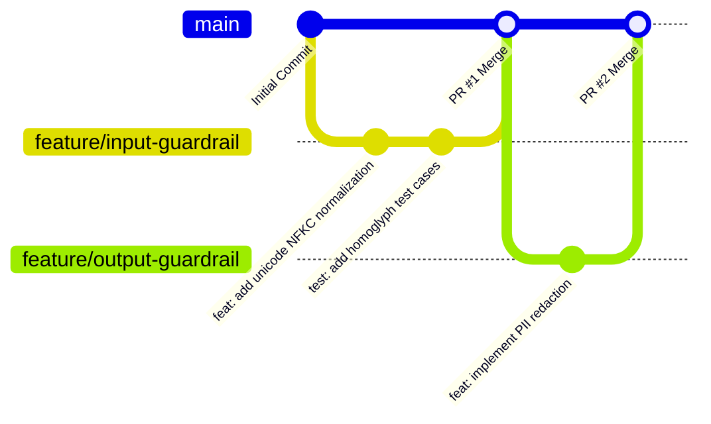

# Git 워크플로우 및 브랜치 전략 (GIT_WORKFLOW.md)

## 1. 개요 (Overview)
본 문서는 `AI Security Guardrail Chatbot` 프로젝트의 협업 및 형상 관리를 위한 Git 브랜치 전략, 커밋 메시지 규약, 코드 리뷰 및 PR(Pull Request) 절차를 규정합니다.

---

## 2. 브랜치 전략 (Branching Strategy)

우리는 **GitHub Flow**를 기반으로 한 경량화되고 안전한 Feature Branch 전략을 채택합니다.



### 2.1 브랜치 명명 규칙 (Branch Naming)
- `main`: 항시 배포 및 테스트 가능한 안정된 프로덕션 브랜치.
- `feature/<기능명>`: 새로운 기능 개발 (예: `feature/execution-guardrail`, `feature/threat-dao`)
- `bugfix/<이슈명>`: 버그 수정 (예: `bugfix/url-decode-exception`)
- `chore/<작업명>`: 인프라, 설정, 빌드, 문서 작업 (예: `chore/engineering-guidelines-cicd`)
- `hotfix/<긴급패치>`: 긴급 보안 취약점 조치 (예: `hotfix/cve-patch`)

---

## 3. 커밋 메시지 규약 (Conventional Commits)

커밋 메시지는 다음 구조를 준수합니다:
`<Type>: <Subject>`

### 3.1 허용되는 Type 목록
- `feat`: 새로운 기능 추가 (예: `feat: add Base64 de-obfuscation pipeline`)
- `fix`: 버그 수정 (예: `fix: handle null payload in request validator`)
- `docs`: 문서 추가 및 수정 (예: `docs: update API_CONTRACT.md with tools endpoint`)
- `style`: 코드 포맷팅, 세미콜론 누락 등 (비즈니스 로직 변경 없음)
- `refactor`: 코드 리팩토링 (기능 변경 없음)
- `test`: 테스트 코드 추가 및 리팩토링 (예: `test: add BOLA authorization unit tests`)
- `chore`: 빌드 업무, 패키지 매니저 설정, CI/CD 워크플로우 변경

---

## 4. 작업 및 PR 절차 (Pull Request Lifecycle)

1. **브랜치 생성**:
   `main` 브랜치 최신 상태에서 feature 브랜치를 생성합니다.
   ```bash
   git checkout main
   git pull origin main
   git checkout -b feature/guardrail-engine
   ```
2. **로컬 개발 및 자체 검증**:
   - Ruff 린트 검증: `ruff check .`
   - 전체 테스트 통과 확인: `pytest`
   - 시크릿 포함 여부 검사: `git diff`
3. **커밋 및 원격 푸시**:
   ```bash
   git add <변경파일>
   git commit -m "feat: implement 7-step input guardrail pipeline"
   git push -u origin feature/guardrail-engine
   ```
4. **Pull Request 생성 및 CI 검증**:
   - PR 템플릿에 따라 변경 내용, 테스트 결과 기술.
   - GitHub Actions CI 파이프라인의 모든 검사(Lint, Test, Secret Scan) 통과 필수.
5. **코드 리뷰 및 Merge**:
   - 코드 리뷰어 승인 후 `Squash and Merge` 또는 `Rebase and Merge` 수행.

---

## 5. 절대 금지 사항 (Strict Rules)
- `main` 브랜치에 직접 커밋 푸시 금지.
- `git push --force` 사용 금지 (원격 히스토리 덮어쓰기 방지).
- `.env`, API Key, DB 비밀번호 등 시크릿 파일 스테이징 및 커밋 금지.
