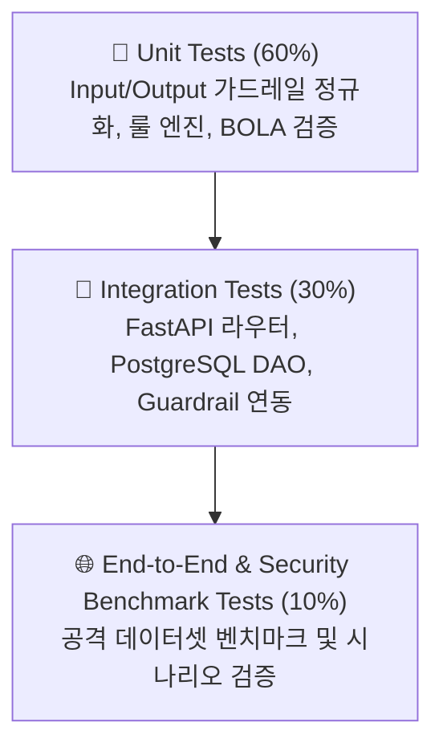

# 테스트 전략 및 검증 계획 (TEST_STRATEGY.md)

## 1. 테스트 개요 (Overview)
본 문서는 `AI Security Guardrail Chatbot`의 품질 보증, 기능 검증 및 보안 방어율 측정을 위한 체계적인 테스트 전략을 정의합니다.

---

## 2. 테스트 피라미드 구조 (Test Pyramid)



---

## 3. 테스트 계층별 상세 전략

### 3.1 단위 테스트 (Unit Tests)
- **대상**:
  - `InputGuardrail`: 정규화(NFKC), 호모글리프 변환, Base64/URL 디오브퓨스케이션, 시그니처 매칭.
  - `OutputGuardrail`: PII(주민번호, 카드번호, 전화번호, 원가) 마스킹, 리버스 쉘 페이로드 차단, XSS 살균.
  - `ExecutionGuardrail`: BOLA/IDOR 소유권 및 권한 검증.
  - `RuleManager`: 인메모리 캐싱 및 Hot-Reload 동작 검증.
- **도구**: `pytest`, `pytest-mock`
- **실행 원칙**: 외부 의존성(DB, Ollama 등) 없이 1초 이내 고속 실행.

### 3.2 통합 테스트 (Integration Tests)
- **대상**:
  - FastAPI API 엔드포인트 (`/api/v1/health`, `/v1/chat/completions`, `/api/v1/guardrails/rules`, `/api/v1/audit/logs`).
  - `ThreatIntelDAO`, `ShopDAO`, `AuditDAO`와 테스트용 DB 세션 연동.
- **도구**: `httpx.AsyncClient`, `pytest-asyncio`
- **환경**: CI 환경에서는 GitHub Actions PostgreSQL 서비스 컨테이너 활용, 로컬에서는 경량 SQLite/Postgres 테스트 세션 사용.

### 3.3 보안 벤치마크 평가 (Security Benchmark Evaluation)
- **목적**: 대량의 공격 페이로드(Attack Set) 및 정상 질의(Benign Set)에 대한 정량적 보안 성능 지표 측정.
- **핵심 평가지표 (KPIs)**:
  1. **공격 탐지율 (True Positive Rate / Recall)**: **98% 이상** 달성.
  2. **정상 질의 오탐율 (False Positive Rate / FPR)**: **1% 이하** 달성.
  3. **평균 가드레일 검사 지연시간 (Latency)**: **5ms 이하** 달성.

---

## 4. 테스트 실행 명령어 명세

### 4.1 전체 단위 및 통합 테스트 실행
```bash
# 전체 테스트 실행 및 커버리지 측정
pytest -v --cov=app --cov-report=term-missing
```

### 4.2 가드레일 핵심 모듈 단독 테스트
```bash
# Input 가드레일 테스트
pytest tests/test_input_guardrail.py -v

# Output 가드레일 테스트
pytest tests/test_output_guardrail.py -v

# Execution (BOLA) 가드레일 테스트
pytest tests/test_execution_guardrail.py -v
```

---

## 5. 지속적 테스트 및 CI 연동
- GitHub Actions CI 워크플로우(`.github/workflows/ci.yml`)에서 PR 생성 및 `main` 브랜치 푸시 시 자동 실행.
- 단위 테스트 실패 또는 코드 커버리지 미달 시 머지(Merge) 차단.
